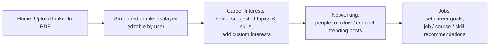

# Business Purpose — NetworkPro (CareerPro-v2)

## 1. Product Identification

| Attribute | Value |
|---|---|
| Product name | **NetworkPro** |
| Repository | `CareerPro-v2` (GitHub: `nmuru/CareerPro-v2`) |
| Self-description | "A career and networking app that analyzes LinkedIn profile data to provide personalized AI-powered recommendations for career growth, networking, and skill development" (`README.md`, `client/index.html` page title/meta description) |
| Origin | Generated as a one-shot prototype on Replit (README: "Vibe coded with replit. One shot created"); Replit-specific tooling is present in `vite.config.ts` (`@replit/vite-plugin-*`) and `server/index.ts` binds to Replit's conventional port 5000 |

## 2. Business Purpose Statement

NetworkPro exists to solve a single, well-defined problem for individual professionals: **turning a static LinkedIn profile into actionable, personalized career guidance without requiring users to hand over LinkedIn account access.**

A user uploads their LinkedIn profile as a PDF, the system derives a structured professional profile from it, asks the user to confirm career interests and goals, and then presents curated recommendations across three areas:

1. **Networking** — professionals to follow, people to connect with, and trending posts worth reading.
2. **Jobs** — matched job openings with salary ranges and match percentages.
3. **Skill development** — recommended courses and market-relevant skills to acquire next.

The intended outcome for the user is a guided, four-step "journey" (the app's own framing: *"Your Journey to Career Success"*, `client/src/pages/HomeTab.tsx`) that ends with concrete next actions for career growth: who to contact, which jobs to pursue, and what to learn.

This purpose is explicitly documented in the original project brief preserved in the repository (`attached_assets/Pasted-Project-Title-NetworkPro-Overview-…txt`): *"Build a career and networking app that integrates LinkedIn profile data… allow users to upload their LinkedIn profile as a PDF (instead of OAuth authentication for now) and extract relevant details to provide personalized career and networking recommendations."* The brief also fixes the deliberate design choice to avoid LinkedIn OAuth in favor of PDF upload.

## 3. Problem Addressed

The repository evidence indicates the product targets these pain points:

- **Friction of profile-based personalization.** OAuth integration with LinkedIn is deliberately deferred (project brief, lines 4 and 37); PDF upload is positioned as a low-friction substitute so the personalization loop can work without an API partnership or credentials flow.
- **Unstructured career exploration.** Job boards and LinkedIn itself present generic listings; NetworkPro's concept is to filter jobs, connections, courses, and skills through the lens of the user's own extracted profile plus stated interests and goals.
- **Scattered decision inputs.** The app consolidates four normally separate activities — profile review, interest selection, networking triage, and job/learning search — into one sequential wizard.

## 4. Intended Users

- **Primary user:** individual professionals and job seekers who maintain a LinkedIn presence — evidenced by the LinkedIn-branded UI (`Header.tsx` uses the LinkedIn glyph and LinkedIn blue `#0077B5`), the PDF upload flow, and copy such as "Elevate your career with AI-powered networking insights" (`HomeTab.tsx`).
- **Demonstration persona:** the seeded content skews toward technology product-management careers (mock jobs at Google/Salesforce/Airbnb, PM-oriented courses and skills in `server/routes.ts`; default career goals of "Product Manager / Technology / San Francisco" in `routes.ts` and preselected values in `JobsTab.tsx`). This indicates the prototype was tuned for a tech/PM audience, although nothing in the domain model restricts it to that segment.

There is no evidence of any other user class: no administrative interface, no organizational/tenant concept, no recruiter-facing surface, and no consuming external system. The brief's mention of "recruiters" as a recommendation category was not implemented. Authentication is absent from the running system — every API route hardcodes `userId = 1` ("For demo, we'll use userId 1", `server/routes.ts`), and the storage layer seeds exactly one demo account (`MemStorage` constructor, `server/storage.ts`).

## 5. Core User Workflow

The application implements one end-to-end workflow, structured as four tabs driven by `client/src/App.tsx` (`home → interests → networking → jobs`):

Traced through the code, the representative flow is:

1. **Upload** — `FileUploader` (drag-and-drop or browse) → `useLinkedInProfile.handleFileUpload` → `parsePDF` posts the file to `POST /api/profile/upload` → server extracts profile fields → profile persisted and returned (`client/src/lib/pdf-parser.ts`, `server/routes.ts`).
2. **Profile confirmation** — extracted details render in `ProfileCard` with an **Edit Profile** action (`PUT /api/profile` via `ProfileEditor`).
3. **Interest capture** — `InterestsTab` fetches suggestions from `GET /api/interests/suggestions`, lets the user toggle topics/skills and add free-text interests, and saves via `POST /api/interests`.
4. **Networking recommendations** — `NetworkingTab` renders people-to-follow, people-to-connect, and trending posts from `GET /api/recommendations/networking`, with refresh and show-more controls; Follow/Connect actions acknowledge via toast notifications.
5. **Job recommendations** — `JobsTab` captures career goals (desired role, industry, location, salary range) via `POST /api/career-goals` and displays job openings, courses, and skills from `GET /api/recommendations/jobs`.
6. **Save for later** — every card type (person, post, job, course, skill) offers bookmarking through `useSavedItems` → `POST/GET/DELETE /api/saved-items`, fulfilling the brief's persistent "save for later" requirement.

## 6. Core Domain Concepts

The domain model (`shared/schema.ts`, mirrored in `client/src/types/index.ts`) confirms the business focus:

| Concept | Real-world meaning |
|---|---|
| **Profile** | A professional's résumé-equivalent: name, headline, location, industry, current role/company, experience, education, skills, certifications |
| **Interests** | The user's declared professional directions: topics and skills they want to grow in |
| **Career Goals** | Target state: desired role, industry, location, salary range |
| **Saved Item** | A bookmark on any recommendation (`person`, `job`, `course`, `post`, `skill`) |
| **Recommendation sets** | People to follow, people to connect with, trending posts, job openings, courses, skills to develop |
| **User** | Account holder (exists in schema/storage but unused by the running flows) |

These entities map one-to-one onto the career-coaching problem space rather than onto any technical domain, corroborating the stated purpose independently of the README.

## 7. Strength of Evidence Summary

| Conclusion | Classification | Key artifacts |
|---|---|---|
| Product is a LinkedIn-profile-driven career/networking advisor | Verified fact | Project brief in `attached_assets/`, `README.md`, `index.html`, full UI/API/domain-model alignment |
| Users are individual professionals/job seekers | Verified fact (single-user demo) + reasonable inference (target segment beyond tech/PM) | Hardcoded `userId=1` throughout `routes.ts`; UI copy; demo content |
| Four-step guided workflow is the core experience | Verified fact | `App.tsx`, four tab pages, matching step indicator in project brief |
| Recommendations should be personalized and refreshable, with save-for-later persistence | Verified fact (intent + structure) | Brief §"Refreshing & Storing Recommendations", `/api/recommendations/*`, `/api/saved-items`, refresh buttons |
| Analysis and recommendations are genuinely AI-powered | **Contradicted** | No LLM/AI SDK in `package.json` or any import; `extractTextFromPdf` returns a canned profile ("Simulating PDF extraction", `routes.ts`); all recommendation generators return fixed arrays |
| Production deployment includes the backend | **Uncertain / contradicted** | README states "Currently does not have any backend – vercel deployed frontend", yet `server/` implements a full Express API; Vercel badge links to a deployed frontend |
| PostgreSQL persistence is part of the running system | **Not established** | Drizzle schema and config exist (`shared/schema.ts`, `drizzle.config.ts`), but runtime storage is in-memory (`MemStorage`); Postgres-related packages (`@neondatabase/serverless`, `connect-pg-simple`, `drizzle-orm`) are declared but never imported by application code |

## 8. Documented Intent vs. Implemented Behavior

Material discrepancies affecting how the business purpose should be read:

1. **"AI-powered" is presentational, not functional.** The README and UI repeatedly promise AI analysis ("Our AI is processing your LinkedIn data…", `HomeTab.tsx`). The implementation simulates both analysis steps: PDF text extraction ignores the uploaded file and returns a fixed sample profile (`extractTextFromPdf`, `routes.ts`), and all six recommendation categories come from hardcoded arrays. The business purpose is therefore best described as the **product concept and interaction design** for an AI career advisor, delivered as a demonstration scaffold rather than a working intelligence capability.
2. **Backend existence is contradicted by the README.** The README asserts there is no backend; the repository clearly contains one. The most consistent interpretation is that the public Vercel deployment serves only the static frontend while this repository retains the Replit-generated backend used during development — but the repository alone cannot confirm what the hosted instance actually runs.
3. **Persistence is ephemeral.** Profiles, interests, goals, and saved items live only in process memory and reset on restart, so the "persistent storage" promised by the brief is not yet real despite the schema existing for it.
4. **Brief features not implemented:** "Experts to Consult", "Recruiters to Connect With", dismiss/ignore actions, and profile picture/certification extraction are specified in the brief but absent from the UI and API. Implemented-but-undocumented additions include dark/light mode, custom free-text interests, and profile editing.
5. **Prototype signals:** non-PDF files are accepted with a warning "for the demo" (`file-uploader.tsx`), Follow/Connect produce toast messages only, and git history consists of README edits and file uploads around the initial generated drop.

## 9. Current Status Interpretation

All evidence supports classifying NetworkPro as a **functional front-end prototype / product demonstrator**: the complete user journey, navigation, forms, API contract, and domain model exist and are internally consistent, but the differentiating substance (real PDF parsing, real personalization logic, real data sources, durable storage, authentication) is intentionally stubbed. Its business purpose today is to validate and demonstrate the career-guidance concept and interaction flow — plausibly as a portfolio piece, given its origin story and MIT license — rather than to deliver those outcomes to real end users.

## 10. Remaining Unknowns

- Whether any deployed instance serves the backend API alongside the frontend, and who, if anyone, has used the product beyond its author.
- Whether the PostgreSQL/Drizzle layer represents an abandoned migration path or planned future work; no migrations directory or database wiring exists to decide.
- The intended long-term monetization or distribution model; nothing in the repository addresses pricing, tenancy, or go-to-market.
- Whether the fixed PM/tech content reflects the target market or merely convenient sample data; the brief is market-neutral while all demo content is tech-skewed.
- Original development timeline and iteration history beyond the visible git log (initial upload followed by README edits and a test-branch merge).