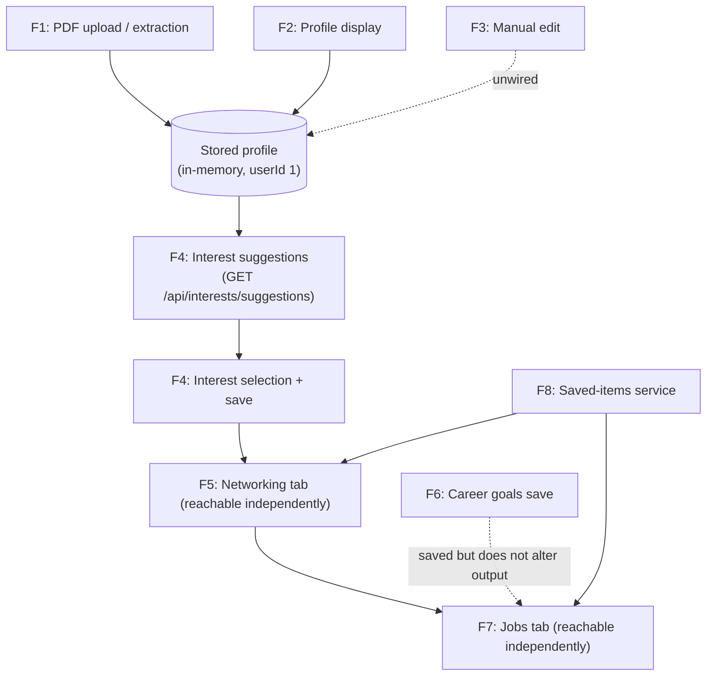

# Features — NetworkPro (repository `CareerPro-v2`)

## 1. Feature Model Overview

NetworkPro is a single-page web application that presents itself as a career and networking assistant driven by a user's LinkedIn profile. The implemented product is a **four-step guided demonstration**: the user uploads a LinkedIn profile PDF, reviews the extracted profile, selects career interests, receives networking recommendations, and finally defines career goals alongside job/course/skill recommendations.

All recommendation content shown by the application is **statically generated mock data served by a local Express API**, and the profile "extraction" step is **explicitly simulated** (`server/routes.ts` contains `extractTextFromPdf`, commented *"Simulating PDF text extraction (no actual parsing, just returns mock data)"). The application therefore implements complete, working user workflows whose analytical substance is demo-grade rather than real.

The externally visible feature surface consists of:

| # | Feature | Surface | Status |
|---|---------|---------|--------|
| 1 | LinkedIn PDF upload and profile extraction | Home tab + `POST /api/profile/upload` | Implemented as workflow; extraction simulated |
| 2 | Profile presentation | Home tab (`ProfileCard`) | Implemented |
| 3 | Manual profile editing | Home tab button + `PUT /api/profile` | Partially implemented (editor component unreachable) |
| 4 | Career interest discovery and selection | Career Interests tab | Implemented (fixed suggestion data) |
| 5 | Networking recommendations (follow/connect/save/ignore) | Networking tab | Implemented (simulated actions, static data) |
| 6 | Career goals definition | Jobs tab + `/api/career-goals` | Implemented |
| 7 | Job, course, and skill recommendations | Jobs tab | Implemented (apply/enroll are placeholder actions) |
| 8 | Saved-item bookmarking | All recommendation cards + `/api/saved-items` | Implemented at card/API level; no browsing view |
| 9 | Guided tab-based navigation | Global tab bar + step wizard | Implemented |
| 10 | Recommendation refresh | Networking and Jobs tabs | Implemented mechanically; produces identical data |
| 11 | Dark/light theme toggle | Header | Implemented |

## 2. Actors and Triggers

Only one actor class is evidenced:

- **End user (anonymous, implicitly a single demo user).** Every request is executed for the hard-coded identity `userId = 1` (`server/routes.ts`, repeated comment *"For demo, we'll use userId 1"*). There is no login, registration, or session feature; although `passport`, `passport-local`, `express-session`, and `connect-pg-simple` are declared in `package.json`, no authentication routes or middleware exist in `server/`.

No administrative, scheduled, event-driven, or external-system actors exist. All features are triggered interactively from the browser. The Express server seeds one demo user (`demo` / `password`) in memory at startup (`server/storage.ts`, constructor), but nothing exposes or consumes it.

## 3. Primary User Features

### 3.1 LinkedIn Profile Upload and Extraction

- **Capability:** The user provides their LinkedIn profile as a PDF and the system derives a structured profile (name, headline, location, industry, current role/company, education, experience, skills).
- **Actor/trigger:** End user on the Home tab, via drag-and-drop or file-picker upload, or the **"Continue with Demo Data"** shortcut that synthesizes a dummy PDF file client-side (`client/src/components/ui/file-uploader.tsx`, `handleDemoSkip`).
- **Workflow:**
  1. Client-side pre-validation: non-PDF files are accepted with a warning toast (*"For this demo, we'll process your file"*); files over 5 MB are rejected (`file-uploader.tsx`, `validateFile`).
  2. `useLinkedInProfile.handleFileUpload` → `parsePDF` (`client/src/lib/pdf-parser.ts`) issues `POST /api/profile/upload` with multipart field `pdf`.
  3. Server-side multer middleware enforces a 5 MB limit and `application/pdf` MIME type (`server/routes.ts` lines 8–19).
  4. `extractTextFromPdf` ignores the uploaded bytes and returns a fixed sample LinkedIn profile text; `extractProfileFromText` then runs regex parsing over that text (`routes.ts` lines 308–442).
  5. The resulting profile is created or updated in the in-memory store for `userId 1` and returned as JSON.
  6. The client caches it under the `/api/profile` React Query key and switches the Home tab into its analyzed-profile state.
- **Outcome:** A populated profile record drives the rest of the wizard (profile card, interest-suggestion eligibility).
- **Evidence:** `client/src/pages/HomeTab.tsx`, `file-uploader.tsx`, `lib/pdf-parser.ts`, `hooks/useLinkedInProfile.ts`, `server/routes.ts` (`POST /api/profile/upload`), `server/storage.ts`.
- **Status:** **Implemented as a workflow, partially implemented in substance.** The upload pipeline is real end-to-end, but the core extraction is a documented simulation — the produced profile is identical regardless of which file is uploaded. The declared dependency `pdf-parse` is never imported anywhere.

### 3.2 Profile Presentation

- **Capability:** Display the extracted profile in a LinkedIn-style card: name, headline, location, current position/company/industry, education history, experience history, and skill badges, with an avatar placeholder when no photo URL exists.
- **Actor/trigger:** End user; rendered automatically once a profile is loaded.
- **Outcome:** Visual confirmation that the profile was "analyzed", plus a progress checklist marking step 1 of 4 complete.
- **Evidence:** `client/src/components/ui/profile-card.tsx`; conditional rendering in `HomeTab.tsx` (`profile ? … : …`).
- **Status:** **Implemented.**

### 3.3 Manual Profile Editing

- **Capability (intended):** Edit every profile field — including adding/removing skills, education entries, and experience entries — through a modal editor.
- **Evidence:** A complete `ProfileEditor` dialog component exists (`client/src/components/ui/profile-editor.tsx`), the `Edit Profile` button on `ProfileCard` fires `onEdit`, and `HomeTab` stores `showEditForm` state. A supporting backend endpoint `PUT /api/profile` exists and the `updateProfile` mutation is exposed by `hooks/useLinkedInProfile.ts`.
- **Gap:** `HomeTab.tsx` never imports or renders `<ProfileEditor>`; clicking **Edit Profile** sets a state flag that nothing consumes, so **the button is inert**. Consequently `PUT /api/profile` currently has no reachable consumer in the UI.
- **Status:** **Partially implemented / disconnected.** Backend and dialog are built; the wiring between button and dialog was never completed.

### 3.4 Career Interest Discovery and Selection

- **Capability:** The user is offered suggested interest areas (topics) and skills, selects any of them, adds free-text custom interests, and saves the selection.
- **Actor/trigger:** End user on the Career Interests tab.
- **Workflow:**
  1. `GET /api/interests/suggestions` is fetched; the server requires an existing stored profile and otherwise responds `404` (`routes.ts` lines 592–608). Suggestions are two fixed five-item lists produced by `suggestInterests` — the response does not vary with profile content despite the code receiving it.
  2. Previously saved selections (`GET /api/interests`) re-check matching checkboxes and restore custom interest strings not present in the suggestion lists (`InterestsTab.tsx`, second `useEffect`).
  3. The user toggles topics/skills (with decorative hard-coded "Popular"/"Trending" badges keyed off item IDs) and may add custom interests via input + Enter/Add button; duplicates are rejected with a toast.
  4. **Continue to Networking** saves `{topics[], skills[]}` via `POST /api/interests` (upsert in memory) before navigating.
- **Outcome:** Persisted interest selection for the demo user.
- **Degraded mode:** If no profile exists, the suggestions call fails and the tab renders with empty suggestion grids; custom-interest entry and saving still function.
- **Evidence:** `client/src/pages/InterestsTab.tsx`, `hooks/useInterests.ts`, `hooks/useRecommendations.ts` (`useInterestSuggestions`), `components/ui/interest-checkbox.tsx`, `server/routes.ts`.
- **Status:** **Implemented** as a complete client-server workflow; the "AI-powered" framing in the README/UI copy is not backed by adaptive logic (fixed suggestion data, simulated badges).

### 3.5 Networking Recommendations

- **Capability:** Present three recommendation groups — People to Follow, People to Connect With, Trending Posts — each with per-card actions.
- **Actor/trigger:** End user opening the Networking tab; data fetched via `GET /api/recommendations/networking`.
- **Workflow:**
  - Server returns static arrays of five people to follow, five people to connect with, and five trending posts, generated unconditionally (`generatePeopleToFollow`, `generatePeopleToConnect`, `generateTrendingPosts`; `routes.ts` lines 22–158, 660–676). No profile, interest, or goal input influences the result.
  - Cards render incrementally (initially 3/3/2 items) with **Show More** pagination (`NetworkingTab.tsx` visible-count state; `show-more-button.tsx`).
  - Per-person actions: **Follow** / **Connect** raise confirmation toasts only (`handleFollow`/`handleConnect`) — there is no LinkedIn integration or outbound call of any kind.
  - Every card additionally supports **Save for Later** (bookmark toggle) and **Ignore** (card removed from view for the session) via `recommendation-card.tsx` / `post-card.tsx` and the saved-items service (§3.8).
  - A **Refresh Recommendations** button refetches the query (`refresh-button.tsx` → React Query `refetch`); because the generator is deterministic, refreshed results are identical.
- **Outcome:** Browsable, actionable-looking networking suggestions.
- **Evidence:** `pages/NetworkingTab.tsx`, `hooks/useRecommendations.ts`, `components/ui/recommendation-card.tsx`, `post-card.tsx`, `server/routes.ts`.
- **Status:** **Implemented** (display, pagination, bookmark, ignore, refresh); **Follow/Connect are simulated confirmations**, and personalization is absent.

### 3.6 Career Goals Definition

- **Capability:** Define desired role, industry, location, and salary range; persist them as career goals.
- **Actor/trigger:** End user on the Jobs tab.
- **Workflow:** Four `Select` controls offer small fixed option sets (e.g., roles limited to Product Manager → VP of Product; industries limited to Technology/Healthcare/Finance/Education). **Update Goals** saves via `POST /api/career-goals` (upsert) and then triggers a recommendations refresh. `GET /api/career-goals` returns hard-coded defaults (`Product Manager`, `Technology`, `San Francisco, CA`, `$120,000 - $150,000`) when nothing is stored (`routes.ts` lines 729–749).
- **Outcome:** Stored goal record. Note that **goals do not feed the recommendation generators** — refreshing after updating goals returns exactly the same static job/course/skill lists.
- **Evidence:** `pages/JobsTab.tsx` (`handleUpdateGoals`), `hooks/useCareerGoals.ts`, `server/routes.ts`.
- **Status:** **Implemented** for persistence; the implied cause-effect between goals and recommendations is **not implemented**.

### 3.7 Job, Course, and Skill Recommendations

- **Capability:** Present Top Job Openings (title, company, location, posting age, applicant count, salary range, color-coded match percentage), Recommended Courses (provider, star rating, review count), and Skills to Develop (demand badge, description, quantified advantage claim).
- **Actor/trigger:** End user on the Jobs tab; data from `GET /api/recommendations/jobs`.
- **Workflow:** Static generators return five items per category regardless of any user context (`generateJobOpenings`, `generateCourses`, `generateSkills`). Cards support:
  - **Apply Now** (job) — toast *"Application initiated"* only; no external application flow.
  - **Enroll** (course) — toast *"Enrollment initiated… being redirected"* only; no redirect occurs.
  - **Explore courses** (skill) — toast only.
  - **Bookmark** save/unsave and **Ignore** (jobs and people cards; courses/skills/posts support bookmark only).
  - **Show More** pagination (3 per group initially) and the shared **Refresh** button (identical data on refetch).
- **Outcome:** Browsable opportunity catalog with placeholder engagement actions and durable bookmarking.
- **Evidence:** `pages/JobsTab.tsx`, `components/ui/job-card.tsx`, `course-card.tsx`, `skill-card.tsx`, `hooks/useRecommendations.ts`, `server/routes.ts` lines 160–306, 679–695.
- **Status:** **Implemented** (display/pagination/bookmark); **Apply/Enroll/Explore are placeholder interactions**.

### 3.8 Saved Items (Bookmarking)

- **Capability:** Save/unsave any recommended entity (person, job, course, post, skill) and recall saved state.
- **Actor/trigger:** End user via bookmark icons on recommendation cards; implemented centrally in `hooks/useSavedItems.ts` and consumed by all five card types.
- **Workflow:** `POST /api/saved-items` creates a record (`itemType`, `itemId`, full `itemData` snapshot, `userId 1`); `GET /api/saved-items` (optionally filtered by `?type=`) feeds `isItemSaved`, which seeds each card's bookmark state on mount; `DELETE /api/saved-items/:id` removes a bookmark (404 if absent). React Query invalidation keeps card states consistent after mutations.
- **Outcome:** Bookmarks survive in-app navigation because they live server-side — **but only within one server process**: backing storage is `MemStorage` (in-memory Maps), so everything is lost on restart. The project specification calls for *persistent storage*; this is **not satisfied**. A fully written client-side `localStorage` alternative exists in `client/src/lib/storage.ts` but is imported by nothing (apparently unused/legacy).
- **Boundary note:** There is **no saved-items listing or management view**; users cannot browse what they saved — saved state is only observable as highlighted bookmark icons.
- **Evidence:** `hooks/useSavedItems.ts`, `lib/storage.ts`, `server/routes.ts` lines 752–800, `server/storage.ts` lines 159–179, card components listed above.
- **Status:** **Implemented** (API + card integration); **no retrieval UI**; **persistence objective documented but unmet**.

### 3.9 Guided Tab-Based Navigation

- **Capability:** A four-step journey — Home → Career Interests → Networking → Jobs — with per-step Back/Next/Return controls, progress indicators, and a persistent global tab bar allowing free movement between steps.
- **Workflow/state:** Tab selection is plain React state in `App.tsx` (`activeTab`, `TabType`); there is **no URL routing** — `wouter` is a declared dependency but is never imported, and `pages/not-found.tsx` is unreferenced. Deep-linking and browser back/forward are therefore not supported.
- **Evidence:** `App.tsx`, `components/layout/TabNavigation.tsx`, step components in `HomeTab.tsx`/`InterestsTab.tsx`.
- **Status:** **Implemented** (in-memory navigation only).

### 3.10 Dark/Light Theme Toggle

- **Capability:** Switch between light and dark appearance; choice persisted in `localStorage` under key `networkpro-theme` (default light).
- **Evidence:** `components/layout/Header.tsx` (toggle button), `lib/theme-provider.tsx` (context provider applying the `dark` class to the document root), `main.tsx` (provider setup).
- **Status:** **Implemented.**

### 3.11 Recommendation Refresh

- **Capability:** Explicit refresh control on the Networking and Jobs tabs with spinner feedback (minimum 750 ms for perceived responsiveness).
- **Reality check:** Refetch hits the same deterministic generators, so the feature performs a network round-trip without changing content.
- **Evidence:** `refresh-button.tsx`, `useRecommendations.ts` (`refetch` exposure).
- **Status:** **Implemented mechanically; functionally inert** given current mock data.

## 4. System-Level Capabilities

These are internal behaviors that support the user features rather than independent user-facing functions:

- **Mock recommendation API layer:** Deterministic generators plus thirteen REST endpoints (`/api/profile*`, `/api/interests*`, `/api/recommendations/*`, `/api/career-goals`, `/api/saved-items*`) returning JSON; every route logs method/path/status/duration to the console (`server/index.ts`).
- **In-memory domain store (`MemStorage`):** Implements create/read/update for profiles, interests, saved items, and career goals against `Map`s with sequential IDs; seeded with one demo user. The `IStorage` interface is designed to allow swapping implementations.
- **Single-tenant demo semantics:** Fixed `userId 1` on every operation; concurrent browser sessions share one data set.
- **SPA serving:** Development mode serves the React app through Vite middleware; production mode serves the built client from `dist/public` with an index.html fallback (`server/vite.ts`, `vite.config.ts`).
- **Request validation:** Multer enforces upload size/MIME constraints; API handlers wrap logic in try/catch returning JSON error messages with 400/404/500 codes. Request bodies for interests, goals, profile updates, and saved items are accepted without schema validation at runtime (Zod schemas generated in `shared/schema.ts` are not applied to incoming requests).

## 5. Feature Dependencies

Evidence-supported dependencies:

- **Interest suggestions depend on a stored profile** (explicit `404` branch when absent).
- **The Networking and Jobs tabs do not depend on the profile or interests at runtime** — they are freely reachable from the tab bar and their endpoints ignore all user context. The wizard order implies a dependency chain that the implementation does not enforce.
- **Bookmarking depends solely on the saved-items API**; it works on any card irrespective of other features.
- **All features depend on the Express backend being reachable.** This matters for deployment: the README states the deployed Vercel instance is a frontend build with *no backend*, in which case profile upload, interests, recommendations, goals, and bookmarks cannot function. Repository evidence cannot establish how (or whether) the deployed variant addresses this.

## 6. Documented Intent vs. Implemented Behavior

Two intent sources exist in-repo: the original project brief (`attached_assets/Pasted-Project-Title-NetworkPro-Overview-….txt`) and `README.md`. Material comparisons:

| Documented intent | Implementation reality |
|---|---|
| Upload LinkedIn PDF and *extract* key details | Upload pipeline real; extraction simulated with fixed sample text (`routes.ts` line 308–312) |
| "Top 5 Recommendations" personalized per industry/interests/goals | Five static items per category, identical for all inputs |
| Certifications displayed on Home | Field exists in types/schema; never extracted, never rendered |
| **Experts to Consult** (Networking) | Not implemented — no such category in API or UI |
| **Recruiters to Connect With** (Jobs) | Not implemented — no such category in API or UI |
| "Persistent Storage" for preferences and ignored suggestions | In-memory only; ignored items are session-local client state |
| "Edit Profile" button allows updating information | Button present but inert; editor component built yet unreachable |
| Load More fetches *next five* recommendations | Show More reveals additional items of the same fixed set (max 5) |
| Minimal backend — "Mock API using local JSON" | Full Express server with in-process generators; equivalent spirit, larger footprint |
| README: "Currently does not have any backend - vercel deployed frontend" | Contradicted by the repository itself, which contains a complete backend that every client feature calls; both statements cannot describe the same running artifact |
| README: "AI-powered" analysis and matching | No AI/NLP/ML code present; regex heuristics over mock text and fixed lists |

Additional README/code mismatches: README documents `DATABASE_URL`/`SESSION_SECRET` environment variables and a PostgreSQL stack, but no runtime code reads environment variables or opens a database connection; `drizzle.config.ts` requires `DATABASE_URL` only for the standalone migration tool. Testimonials, match-percentage figures ("95% match accuracy"), and benefit statistics on the Home tab are unverifiable marketing content rendered from hard-coded strings (`HomeTab.tsx`).

## 7. Disconnected and Latent Capabilities

Implementation exists for capabilities that have **no active path** in the running system. These are not counted as features above:

- **`ProfileEditor` dialog** — complete form (skills/education/experience add/remove) never rendered by any page.
- **`PDFViewer`** (`pdf-viewer.tsx`) — full react-pdf-based viewer with paging/zoom/download; imported by nothing (the `react-pdf` dependency is consequently unused).
- **Client-side localStorage store** (`lib/storage.ts`) — parallel saved-items implementation, unreferenced.
- **`PUT /api/profile`** — endpoint live but unreachable from the UI (blocked by the unwired editor).
- **Persistence stack** — `shared/schema.ts` defines five PostgreSQL tables (users, profiles, interests, saved_items, career_goals) with Drizzle/Zod schemas; no server code imports Drizzle at runtime (`@neondatabase/serverless`, `drizzle-orm`, `drizzle-zod` unused in `server/`). `npm run db:push` exists but targets a database the app never touches.
- **Authentication stack** — passport/passport-local/express-session/connect-pg-simple/memorystore declared; no auth code.
- **`pdf-parse`** — declared for the extraction that was ultimately simulated.
- **Miscellaneous** — `simulateExtractText` fallback in `pdf-parser.ts` (never called); numerous unused shadcn/Radix components, `wouter` router, `not-found.tsx`.

These artifacts indicate intended directions (real parsing, real viewing, real persistence, authentication) that were scaffolded but never connected.

## 8. Feature Status Summary

- **Implemented and traceable end-to-end:** profile upload workflow, profile display, interest selection/saving, networking and jobs/courses/skills recommendation display with pagination, bookmarking service, career-goal saving, tab navigation, theme toggle.
- **Implemented mechanically but inert in effect:** refresh, Follow/Connect/Apply/Enroll/Explore actions (toast confirmations only), interest/goal influence on recommendations (none).
- **Partially implemented:** profile extraction (simulated), manual profile editing (unwired), saved-item retrieval (no browsing UI), persistence (in-memory vs. documented persistent storage).
- **Documented but not implemented:** Experts to Consult, Recruiters to Connect With, certifications display, AI-driven personalization, real LinkedIn integration, cross-session persistence.
- **Unknown:** behavior of the publicly deployed Vercel variant referenced in the README badge; the repository alone cannot establish whether that deployment proxies the API, ships the server, or operates as a purely static demo.

No features were inferred beyond these surfaces: every claimed capability above traces to specific routes, pages, hooks, or components cited in this document.