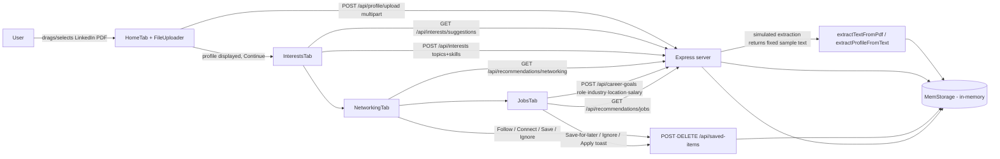

The Business Purpose phase methodology is loaded. I will now begin reconnaissance of the target repository to establish context before reconstructing its business purpose.
Initial context established: this appears to be a career/networking application ("NetworkPro" per README) built on React + Express + Drizzle. There are notable discrepancies already (README says "no backend," yet `server/` exists). Let me trace the actual implementation.
The backend reveals significant evidence: the app manages LinkedIn-profile-based career analysis, but the "AI" is explicitly mocked (`extractTextFromPdf` returns sample text regardless of input; recommendations are static). Now let me examine the frontend pages and remaining server files to trace the full user workflow.
Backend fully traced: routes hardcode a demo user (userId=1), storage is an in-memory `MemStorage` despite Drizzle/PostgreSQL schema definitions existing, and recommendations are static mock data. Now let me trace the frontend workflow — the four-tab flow (Home → Interests → Networking → Jobs) and its data hooks.
The Home tab confirms the marketing framing ("NetworkPro", "AI-powered") and a four-step guided journey. Let me now examine the remaining tabs, branding components, data hooks, and the `attached_assets` directory.
The `attached_assets` folder contains what appears to be the original project specification document. This is a key evidence source for explicit intent. Let me read it along with the remaining tab and hooks.
The original project specification is found in `attached_assets` — it explicitly defines NetworkPro's intent and matches the implementation closely. Let me complete the evidence base: Jobs tab, remaining hooks, client-side storage, Drizzle config, and any test files.
Key discrepancy confirmed: Drizzle config targets PostgreSQL via `DATABASE_URL`, but runtime storage is in-memory `MemStorage`. Also, a parallel client-side `localStorage` persistence exists. Let me verify which persistence path the saved-items hook actually uses, plus remaining config artifacts.
`useSavedItems` calls the server API — the `localStorage` module may be dead code. Let me verify its usage, see the remainder of the Jobs tab, and check repository provenance via git history and page metadata.
Git history shows an "Initial commit" followed by README edits and trivial test commits — consistent with a demo/experimental project. Let me verify whether the "save" actions on recommendation cards are wired to the saved-items API, and check the remaining Interests tab behavior.
All five recommendation card types (job, course, skill, post, person) wire "save" actions through the server saved-items API, confirming bookmarking is a real implemented workflow. One final verification round: how the client initializes queries and whether there is any fallback for the deployed frontend-only mode mentioned in the README.
Evidence base is nearly complete. Two final verification checks: whether `pdf-parse`/`react-pdf` are actually imported anywhere (vs. merely declared), and whether passport/auth wiring exists outside the schema.
All verification complete. I have traced the full evidence chain across the original project specification, README, frontend pages/hooks, backend routes, storage implementation, configuration, and git history. Producing the Business Purpose dossier now.

---

# Business Purpose — NetworkPro (repository `CareerPro-v2`)

## 1. Business Purpose Statement

The repository contains **NetworkPro**, a career-development and professional-networking web application whose stated and implemented purpose is to **let an individual professional upload their LinkedIn profile (as a PDF), extract a structured picture of their professional background, and receive personalized recommendations across five categories — people to follow, people to connect with, job openings, learning courses, and skills to develop — within a single guided, four-step workflow.**

The repository indicates that the system exists today as a **demonstration prototype**: the recommendation "intelligence," the LinkedIn profile parsing, and the user identity are all simulated or hardcoded, while the surrounding product experience (workflow, domain model, API surface, UI) is fully realized. Its business purpose is therefore best understood as proving and showcasing a product concept — an "AI career coach fed by your LinkedIn profile" — rather than delivering that intelligence in production form.

## 2. Problem the Software Addresses

The problem addressed, as evidenced by the project specification (`attached_assets/Pasted-Project-Title-NetworkPro-Overview-Build-a-career-and-networking-app-that-integrates-LinkedIn-pr-1743255341248.txt`) and the README:

> "Build a career and networking app that integrates LinkedIn profile data. The app should allow users to upload their LinkedIn profile as a PDF (**instead of OAuth authentication for now**) and extract relevant details to provide personalized career and networking recommendations."

In real-world terms, the software targets three friction points for individual professionals:

1. **Fragmented career guidance.** Career advice, networking targets, job openings, courses, and skill trends live in separate places. NetworkPro consolidates them into one dashboard driven by a single input (the user's profile).
2. **Onboarding cost of personalization.** Personalization normally requires connecting accounts via OAuth. The design deliberately replaces LinkedIn OAuth with a PDF upload so that personalized guidance can be delivered with zero integration friction.
3. **Lack of direction in skill development.** The Jobs tab pairs career goals (desired role, industry, location, salary range) with recommended courses and market-trend skills ("Skills to Develop" entries such as "AI & Machine Learning — High Demand").

## 3. Apparent Users and Consumers

| Consumer | Evidence | Confidence |
|---|---|---|
| **Individual professionals / job seekers** (primary intended audience) | Product copy throughout the UI: "Elevate your career with AI-powered networking insights…" (`client/src/pages/HomeTab.tsx`); persona-flavored content centered on technology/product-management careers | Verified fact (intended audience); the *actual* deployed audience is unknown |
| **A single demonstration user** (effective runtime audience) | Every API route hardcodes `const userId = 1` with comments "For demo, we'll use userId 1" (`server/routes.ts`, lines 526, 556, 574, …); server seeds user `demo/password` (`server/storage.ts`, line 77) | Verified fact |
| **The developer/owner** operating the project as a public demo and GitHub exercise | README badges link to a Vercel deployment (`career-pro-v2.vercel.app`) and note "Vibe coded with replit. One shot created"; git history shows README edits and trivial commits ("line added", "fe message") merging from a `test-feature` branch | Reasonable inference |

There is **no evidence of any B2B, recruiter-facing, or consuming-system interface** — no machine-to-machine API documentation, no service accounts, and no authentication endpoints at all (no `/api/login`, `/api/register`, or `/api/logout` routes exist anywhere in `server/routes.ts`). The application is exclusively human-facing.

## 4. Outcome Delivered to the User

A user completing the workflow obtains:

1. A **structured digital profile** (name, headline, location, industry, current title/company, experience, education, skills) derived from their uploaded LinkedIn PDF and displayed on the Home tab.
2. **Curated career interests** (topics and skills, including custom entries) that personalize the rest of the experience.
3. **Networking recommendations** — people to follow, people to connect with, and trending posts — presented with Follow/Connect/Save/Ignore actions.
4. **Career-opportunity recommendations** — top job openings (with match percentages and salary ranges), recommended courses, and skills to develop — driven by the user's declared career goals.
5. **Persistent shortlisting** — any recommendation can be saved for later or ignored/dismissed.

That is the fundamental value loop: *one profile input → five categories of actionable, saveable recommendations*.

## 5. Principal Workflow (Traced End-to-End)

The workflow below is verified across frontend pages, React Query hooks, and Express routes.

Step-by-step, all verified in source:

1. **Upload** — `FileUploader` (`client/src/components/ui/file-uploader.tsx`) accepts drag-and-drop or selection; non-PDF files are accepted anyway "For this demo" (line 41–52). `useLinkedInProfile` → `parsePDF` (`client/src/lib/pdf-parser.ts`) POSTs to `/api/profile/upload`.
2. **Extraction** — the server accepts the PDF via multer into memory (5 MB limit, PDF-only filter), then `extractTextFromPdf` **ignores the buffer entirely** and returns a fixed sample LinkedIn profile ("John Doe… Senior Product Manager…"), logging `'Simulating PDF extraction'` (`server/routes.ts`, lines 308–356). Regex-based `extractProfileFromText` parses that text into the profile shape.
3. **Persistence & display** — the profile is upserted into `MemStorage` under userId 1 and returned; `HomeTab` shows "Profile Successfully Analyzed", the extracted profile card, and advances the four-step progress indicator.
4. **Interests** — `InterestsTab` fetches fixed suggestions from `/api/interests/suggestions`, lets the user toggle topics/skills and add custom interests, and saves selections via `POST /api/interests`.
5. **Networking** — `NetworkingTab` renders static mock arrays from `/api/recommendations/networking`; Follow/Connect produce confirmation toasts only (no outbound call to any network).
6. **Jobs & goals** — `JobsTab` captures career goals via constrained dropdowns (four roles, four industries, four locations, four salary bands) and renders static job openings (Google, Salesforce, Airbnb, Microsoft, Netflix), courses, and skill suggestions from `/api/recommendations/jobs`. Job/Course/Skill cards persist Save-for-later through the real saved-items API; Apply shows a toast only.

## 6. Core Domain Concepts

The domain model (`shared/schema.ts`, `client/src/types/index.ts`) reveals the problem space precisely:

| Concept | Representation | Real-world meaning |
|---|---|---|
| **Profile** | `profiles` table / `LinkedInProfile` type | The user's professional identity extracted from LinkedIn |
| **Career Interests** | `interests` table (topics[], skills[]) | Self-declared focus areas steering personalization |
| **Career Goals** | `career_goals` table (desiredRole, industry, location, salaryRange) | Where the user wants to go next |
| **Saved Item** | `saved_items` table, `itemType ∈ {person, job, course, post, skill}` | Bookmarking across all five recommendation categories |
| **Recommendation categories** | `NetworkingRecommendations`, `JobRecommendations` types | People to follow · people to connect · trending posts · jobs · courses · skills |

The vocabulary is consistently career-development oriented across schema, API routes, hooks, and UI labels — strong convergent evidence for the inferred purpose.

## 7. Nature and Maturity: Demonstration Prototype

Multiple independent signals establish that this is a deliberately scoped demo, not a production system:

- **Self-declared**: README — "Vibe coded with replit. One shot created. Currently does not have any backend - vercel deployed frontend."
- **Original spec declares a mock backend strategy**: "Minimal Backend – Mock API using local JSON for simulating backend responses" (project specification, line 107).
- **Simulated parsing**: server-side `extractTextFromPdf` returns canned text regardless of input; the `pdf-parse` dependency is declared in `package.json` but **never imported** in server code.
- **Static recommendation data**: every recommendation generator in `server/routes.ts` returns hardcoded arrays; `suggestInterests` ignores its profile argument.
- **Single hardcoded identity**: userId 1 everywhere; seeded `demo` user; no login/logout/register endpoints despite `users` table, passport/passport-local, express-session, and connect-pg-simple dependencies being present.
- **Non-persistent runtime storage**: `MemStorage` keeps everything in process memory; data is lost on restart.
- **Demo-framed UI copy**: fake testimonials, marketing claims like "95% match accuracy" (`HomeTab.tsx`), "Simulating popular interests for the demo" (`InterestsTab.tsx`).
- **Replit provenance**: `@replit/*` Vite plugins, `REPL_ID` environment check in `vite.config.ts`, single-port serving comment in `server/index.ts` ("It is the only port that is not firewalled").
- **No tests exist** anywhere in the repository (no test files, no test runner configured).

## 8. Stated Intent vs. Implemented Behavior (Cross-Check)

Material discrepancies between documentation/specification and implementation, each verified in source:

1. **Product name vs. repository name.** The application is branded **NetworkPro** everywhere user-visible (README title, `client/index.html` `<title>`, header logo, hero copy, `networkpro-*` localStorage keys). The GitHub repository is named **CareerPro-v2** — apparently an earlier/alternate naming retained only at the repo level. The product identity should be taken from the application, not the repo name.
2. **"No backend" claim vs. shipped backend.** The README states there is no backend, yet the repo contains a complete Express API serving all four tabs' data. The accurate reading: the *publicly deployed* Vercel instance serves the frontend only, while the in-repo backend exists but is demo-grade (in-memory, mocked). Both statements describe different deployment surfaces of the same codebase.
3. **PostgreSQL/Drizzle claimed vs. in-memory used.** README and `package.json` present PostgreSQL + Drizzle ORM as the database; `shared/schema.ts` defines five pg tables and `drizzle.config.ts` requires `DATABASE_URL` (Neon serverless driver also declared). However, the running application wires `MemStorage` (`server/storage.ts`) and never opens a database connection; there is no `migrations/` directory. PostgreSQL support is **scaffolding for a planned upgrade**, not active behavior.
4. **"AI-powered" claims vs. deterministic mocks.** Marketing copy promises AI analysis and match accuracy; no ML/NLP/AI library or API call exists anywhere in the codebase. All outputs are fixed data independent of the uploaded file.
5. **Specification features not implemented.** The original spec lists "**Experts to Consult**" (Networking tab) and "**Top 5 Recruiters to Connect With**" (Jobs tab); no recruiter/expert entity, type, route, or UI section exists. These were descoped during implementation.
6. **Manual profile editing partially wired.** The spec and UI provide an "Edit Profile" affordance, a `PUT /api/profile` endpoint, and a built `ProfileEditor` component, but `HomeTab` never renders the editor (`showEditForm` state is set but unconsumed) and `updateProfile` is exposed but never invoked. Editing is scaffolded, not reachable.
7. **Spec's "persistent storage" not achieved.** Recommendations, profiles, interests, and goals live only in server memory; an unused client-side `localStorage` module (`client/src/lib/storage.ts`, zero importers) suggests an abandoned alternative persistence approach. Only saved-items survive — and only for the lifetime of the server process.

## 9. Evidence Inventory

| Conclusion | Primary artifacts |
|---|---|
| Product identity and purpose statement | `README.md`; `attached_assets/Pasted-Project-Title-NetworkPro-….txt`; `client/index.html`; `client/src/components/layout/Header.tsx` |
| Four-step guided workflow | `client/src/App.tsx` (tab state machine); `pages/HomeTab.tsx`, `InterestsTab.tsx`, `NetworkingTab.tsx`, `JobsTab.tsx` |
| API surface and mocked intelligence | `server/routes.ts` (all generators, `extractTextFromPdf`, hardcoded `userId = 1`) |
| In-memory persistence, demo user | `server/storage.ts` (`MemStorage`, seeded `demo` user) |
| Planned-but-inactive PostgreSQL layer | `shared/schema.ts`; `drizzle.config.ts`; unused deps (`@neondatabase/serverless`, `connect-pg-simple`, `pdf-parse`, passport stack) |
| Bookmarking as the only real write-path UX | `hooks/useSavedItems.ts`; `components/ui/{job,course,skill,post,recommendation}-card.tsx` |
| Prototype/deployment context | `vite.config.ts` (Replit plugins/REPL_ID); git history (initial-commit uploads, test-feature merges); Vercel badge in README |

## 10. Limitations and Unknowns

- **Unknown:** who actually uses the deployed instance; no analytics, auth, or audit artifacts exist to establish real-world usage.
- **Unknown:** whether the Vercel deployment includes any serverless functions backing the API paths; nothing in the repo configures Vercel (no `vercel.json`), and the README explicitly describes the deployment as frontend-only.
- **Unknown:** whether "v2" in the repository name references a prior version of this product; no v1 artifact is present.
- **Not determinable from the repository:** any monetization, growth, or product-roadmap intent. No pricing, telemetry, roadmap, or issue-tracker content exists in the codebase.

## 11. Conclusion

NetworkPro exists to answer one question for an individual professional: *"Given who you are and where you want to go, whom should you connect with, which jobs should you pursue, and what should you learn next?"* It answers it through a deliberate four-step journey — upload a LinkedIn profile PDF, confirm interests, review networking suggestions, set career goals and receive opportunity recommendations — with bookmarking to retain the best suggestions.

The repository demonstrates that this concept was fully designed down to its domain model and API surface, and that the current build is an intentionally mocked, single-user proof-of-concept: the workflow is real, the intelligence is simulated, and the durable infrastructure (database, authentication, true parsing, external integrations) is scaffolded but not activated. This reading reconciles every major artifact in the repository — the original specification, the README's own caveats, the runtime code, and the deployment story — without contradiction.