# Business Purpose

## 1. Executive Summary

NetworkPro (repository: `CareerPro-v2`) is a career-development web application that demonstrates how a professional's LinkedIn profile can be transformed into personalized career guidance. A user uploads their LinkedIn profile as a PDF, the application presents the extracted professional background, and then walks the user through a guided four-step journey — profile review, career-interest selection, networking recommendations, and job opportunities — culminating in curated lists of people to follow, people to connect with, trending posts, job openings, courses, and skills to develop.

The stated intent is an "AI-powered" career and networking assistant. The implementation is a functional front-to-back prototype in which the intelligence layer is simulated: the PDF parsing returns representative sample data, and all recommendations are served from fixed demonstration datasets. The application therefore exists today as a demonstrable product concept — a complete user experience and API surface for AI-driven career coaching — rather than a production system performing real analysis.

## 2. Problem the Software Addresses

The application targets a well-known problem in professional life: career growth depends heavily on knowing *which* people to connect with, *which* jobs to pursue, and *which* skills to build next, but individual professionals rarely have systematic, data-driven answers to these questions. The product hypothesis, recorded in the original project brief stored in `attached_assets/Pasted-Project-Title-NetworkPro-Overview-Build-a-career-and-networking-app-that-integrates-LinkedIn-pr-1743255341248.txt`, is that a person's existing LinkedIn profile already contains the raw material (experience, education, skills, industry) needed to generate such guidance automatically.

Two deliberate scoping decisions in that brief shape the product:

- **PDF upload instead of OAuth** — users upload their LinkedIn profile as a PDF rather than authenticating against LinkedIn, avoiding integration complexity for the initial version.
- **Minimal backend** — the brief explicitly calls for a mocked backend simulating responses while the experience is proven out.

Both decisions are visible in the implementation and confirm that demonstrating the end-user value proposition took priority over production-grade data access and analytics.

## 3. Intended Users

| Audience | Evidence |
|---|---|
| **Primary: individual professionals planning career growth** | The entire UI speaks to a single professional ("Upload Your LinkedIn Profile", "Your Journey to Career Success"); features are framed as personal benefit (job matches, skill development, networking suggestions). `client/src/pages/HomeTab.tsx`. |
| **Job-seeking professionals, skewed toward product/tech roles** | All demonstration content is product-management-centric: mock jobs at Google/Salesforce/Airbnb/Microsoft/Netflix are PM roles; suggested skills include "Product Strategy" and "AI & Machine Learning" (`server/routes.ts`). |
| **Single demo user** | Every API handler operates on a hard-coded `userId = 1` annotated "For demo" (`server/routes.ts`); storage seeds one demo account `demo`/`password` (`server/storage.ts`). There is no registration or login flow reachable from the UI. |

There is no evidence of organizational, recruiter-facing, or B2B usage; no multi-tenancy, billing, or administrative surfaces exist anywhere in the codebase. The README's framing ("Vibe coded with replit. One shot created", MIT license, public deployment badge for `career-pro-v2.vercel.app`) indicates a personal portfolio/prototype project intended to demonstrate the concept publicly.

## 4. Outcome Delivered to the User

A user completing the workflow obtains:

1. **A structured view of their professional profile** — name, headline, location, industry, current role/company, experience, education, and skills presented on an editable profile card (`client/src/components/ui/profile-card.tsx`, `PUT /api/profile`).
2. **Career-interest calibration** — suggested topics and skills the user can select to steer subsequent recommendations (`GET /api/interests/suggestions`, `POST /api/interests`).
3. **Networking targets** — categorized lists of professionals to follow, professionals to connect with, and trending posts in their field (`GET /api/recommendations/networking`).
4. **Opportunity discovery** — matched job openings with salary ranges and match percentages, recommended courses from major learning providers, and market-trend skills with quantified benefit claims (`GET /api/recommendations/jobs`).
5. **Persistence of selections** — career goals and bookmarked items ("save for later") retained across interactions (`POST /api/career-goals`, `POST /api/saved-items`, plus a browser localStorage layer under `networkpro-*` keys in `client/src/lib/storage.ts`).

In the current implementation, outcomes 3 and 4 are populated from fixed sample catalogs rather than computed from the user's profile, so the realized outcome is a faithful *simulation* of the intended outcome. The interactive shell — profile capture, goal setting, preference selection, saving, and refresh flows — is genuinely operational.

## 5. Representative End-to-End Workflow

The primary workflow, traced from UI entry point through backend to outcome:

```mermaid
flowchart LR
    A[User opens app<br/>HomeTab] --> B[Upload LinkedIn PDF<br/>FileUploader]
    B --> C[POST /api/profile/upload<br/>multer PDF validation]
    C --> D[Simulated text extraction<br/>+ regex field parsing<br/>server/routes.ts]
    D --> E[Profile stored<br/>MemStorage userId=1]
    E --> F[Profile card displayed<br/>editable]
    F --> G[InterestsTab<br/>select topics/skills<br/>POST /api/interests]
    G --> H[NetworkingTab<br/>GET /api/recommendations/networking<br/>follow/connect actions]
    H --> I[JobsTab<br/>set career goals<br/>POST /api/career-goals]
    I --> J[GET /api/recommendations/jobs<br/>jobs · courses · skills]
    J --> K[Save items for later<br/>POST /api/saved-items /
    localStorage]
```

Step detail (verified in source):

1. **Entry** — `HomeTab` renders a drag-and-drop uploader accepting files up to 5 MB; non-PDF files are accepted with a notice that "for this demo, we'll process your file" (`client/src/components/ui/file-uploader.tsx`).
2. **Upload** — `parsePDF` in `client/src/lib/pdf-parser.ts` POSTs the file as multipart form data to `/api/profile/upload`.
3. **Server processing** — `server/routes.ts` validates MIME type via multer, then calls `extractTextFromPdf`. That function explicitly logs `Simulating PDF extraction` and returns a hard-coded sample profile regardless of uploaded content. `extractProfileFromText` applies regexes for name, headline, location, industry, company, role, skills, education, and experience.
4. **Persistence** — the parsed profile is created or updated in `MemStorage` (in-memory maps) for the fixed demo user; a loading screen tells the user their profile is being analyzed.
5. **Guided continuation** — the UI reveals step 2–4 of a progress tracker; each tab (Interests → Networking → Jobs) fetches its dataset through React Query hooks (`useInterests`, `useRecommendations`, `useCareerGoals`, `useSavedItems`).
6. **Outcome** — the user reviews recommendations, can refresh them, page through results with "show more", set career goals (role, industry, location, salary range), and bookmark any item type (`person`, `job`, `course`, `post`, `skill`). Follow/connect gestures acknowledge success via toast notifications without any external effect.

This workflow explains why every major component exists: the Express API and storage layer give the wizard real state; the recommendation generators stand in for the future intelligence; the four-tab structure enforces the narrative arc from *who am I* to *where should I go*.

## 6. Core Domain Concepts

The domain model (declared in `shared/schema.ts` and mirrored in `client/src/types/index.ts`) directly encodes the business problem:

| Concept | Meaning in the business problem |
|---|---|
| **Profile** | A professional's LinkedIn-derived identity: headline, location, industry, current role/company, experience, education, skills, certifications. The input to all guidance. |
| **Career Goals** | Where the user wants to go: desired role, industry, location, salary range. The stated objective used to frame opportunity matching. |
| **Interests** | Topics and skills the user elects to follow — the preference signal between profile and recommendations. |
| **Saved Item** | A bookmark on a recommendation (`person`, `job`, `course`, `post`, `skill`), capturing the user's shortlist. |
| **Recommendation sets** | People to follow, people to connect with, trending posts, job openings, courses, skills to develop — the five catalog categories named in the original brief. |
| **User** | An account identity (username/password). Defined in schema and storage interface, but not yet connected to any authentication flow. |

The vocabulary throughout — "match percentage", "mutual connections", "alumni connection", "skills to develop" — is professional-networking language, reinforcing that the system models career-progression decisions, not generic content recommendation.

## 7. Strength of Evidence by Conclusion

| Conclusion | Classification | Key artifacts |
|---|---|---|
| Product name and positioning: LinkedIn-analysis career/networking assistant | Verified fact | `README.md`; `attached_assets/Pasted-Project-Title-NetworkPro-Overview-*.txt`; branding in `Header.tsx` and `HomeTab.tsx` |
| Four-step guided workflow is implemented and wired end-to-end | Verified fact | `client/src/App.tsx`; four `pages/*Tab.tsx`; seven React Query hooks; nine route groups in `server/routes.ts` |
| Recommendation and PDF-analysis intelligence is simulated with static/sample data | Verified fact | `extractTextFromPdf`, `generatePeopleToFollow/Connect`, `generateTrendingPosts`, `generateJobOpenings`, `generateCourses`, `generateSkills` in `server/routes.ts`; demo-mode messaging in `file-uploader.tsx` |
| Single-user demo posture (no auth in active flow) | Verified fact | Hard-coded `userId = 1` throughout `server/routes.ts`; seeded `demo` user in `server/storage.ts`; passport/session dependencies present but unreferenced by runtime code |
| Persistence is in-memory plus browser localStorage; PostgreSQL declared but not connected at runtime | Verified fact | `MemStorage` in `server/storage.ts`; `shared/schema.ts` + `drizzle.config.ts` + `@neondatabase/serverless` dependency with no database client module in `server/` |
| No automated tests exist | Verified fact | No test/spec files or test runner configuration anywhere in the repository |
| Target audience is individual tech/product professionals | Reasonable inference | Demo content uniformly product-management-flavored; single-user design; consumer-style marketing copy |
| Public Vercel deployment is frontend-only while the repo contains the full-stack variant | Reasonable inference | README states "Currently does not have any backend - vercel deployed frontend" alongside a full Express server; dual badges (Vercel + Replit); `server/index.ts` serves API + client on port 5000 for the Replit runtime |
| Real-world adoption beyond the author/demonstration use | Unknown | No analytics, telemetry, user records beyond the seed user, or operational artifacts |

## 8. Documented Intent vs. Implementation

Material discrepancies between what the documentation claims and what the code delivers:

- **"AI-powered" claims vs. deterministic mocks.** The README, hero copy, and feature cards promise AI analysis (including specific claims like "95% match accuracy" and fabricated testimonials in `HomeTab.tsx`). No AI/ML dependency or service call exists in `package.json` or the codebase; all recommendations come from fixed arrays, and the keyword parameter of `generatePeopleToFollow` is ignored. The marketing surface overstates current capability.
- **README's "no backend" statement vs. a full backend in-repo.** Both are accurate for different runtimes: the publicly linked Vercel deployment serves only the frontend, while the repository contains the complete Express backend used when running via `npm run dev` (the Replit mode). The README documents the deployment state, not the repository contents.
- **Spec items not fully realized.** The original brief lists "Top 5 Recruiters to Connect With" and an "Experts to Consult" category; neither appears in the Jobs or Networking tabs. "Load More" pagination exists, but "Ignore" of recommendations is not implemented; only "Save for Later" is.
- **Dual persistence mechanisms.** Saved items can be persisted either server-side (`/api/saved-items`, used by `useSavedItems`) or in localStorage (`lib/storage.ts`); the localStorage path duplicates the API contract with a fixed demo user id. Only the server path is exercised by the current hooks, leaving the localStorage module as an alternate/legacy channel.
- **Database scaffolding ahead of usage.** A complete PostgreSQL schema with Drizzle/Zod types and a migration config exists, but the running application never opens a database connection. This signals the intended production persistence direction without constituting current behavior.

None of these contradictions change the core purpose; they precisely delimit which parts of the purpose are *demonstrated* versus *simulated*.

## 9. Purpose Statement

NetworkPro exists to demonstrate and deliver a personal career-coaching experience built on a professional's own LinkedIn data: capture the profile once, let the system infer interests and goals, and return actionable networking, employment, and learning recommendations. Its immediate users are individual professionals evaluating such a tool, reached through a public demo deployment; its demonstrated scope is the complete interaction model and API design for that experience, with the analytical intelligence represented by realistic placeholder data pending real profile parsing, personalization logic, and durable storage.

Aspects of the purpose that remain unknown from the repository: whether real user adoption exists, whether the LinkedIn-PDF ingestion was ever planned to become live parsing or LinkedIn OAuth integration beyond the brief's "for now" phrasing, and any commercialization intent. The available evidence supports treating the system as a concept-validation prototype rather than an operating product.