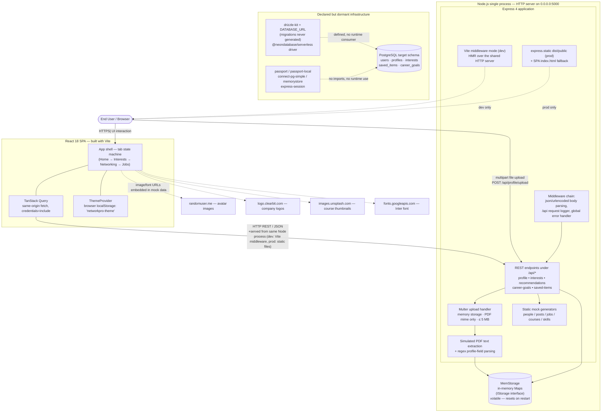

# Technology Architecture — NetworkPro (repository `nmuru/CareerPro-v2`)

## 1. System Overview

NetworkPro is a **single-process, full-stack JavaScript/TypeScript web application**: a React single-page application and an Express REST API are built from one repository and run inside **one Node.js process**, which serves both the JSON API (under `/api/*`) and the browser client.

The system's runtime footprint is deliberately small:

- A **browser client** renders four tab-based views (Home → Career Interests → Networking → Jobs) driven by local tab state rather than URL routing.
- A **Node.js/Express server** exposes a small REST API, receives LinkedIn profile PDF uploads, "extracts" profile data (simulated), persists user-entered data in **volatile in-process memory**, and serves the frontend in both development and production modes.
- There is **no database, no background worker, no message queue, no authentication enforcement, and no outbound server-side integration** in the active execution path.

A significant architectural fact: the repository declares a **PostgreSQL persistence stack (Drizzle ORM + Neon serverless driver)** in its dependencies and schema, but the running application uses an **in-memory storage implementation** instead. Several other declared capabilities (Passport authentication, WebSocket library, real PDF parsing libraries) exist only as dormant dependencies. These are classified explicitly below.

---

## 2. Architecture Diagram

Solid arrows mark relationships verified in source code; dashed arrows mark inferred or dormant relationships.

---

## 3. Major Runtime Components

### 3.1 Browser Client — React 18 SPA

| Aspect | Detail |
|---|---|
| Responsibility | Presents the four-tab career-guidance workflow; manages server-state caching, uploads, and theme persistence |
| Technology | React 18, TypeScript, Vite 5, TanStack React Query 5, Tailwind CSS 3 + Radix UI primitives (shadcn/ui pattern), lucide-react icons |
| Location | `client/` — entry `client/index.html` → `client/src/main.tsx` → `client/src/App.tsx` |
| Inputs | User interactions (tab clicks, form edits, PDF file selection, save/bookmark actions) |
| Outputs | Same-origin HTTP calls to `/api/*`; image/font loads to third-party CDNs |
| Certainty | Verified — full source present, all imports traceable |

Notes:

- Navigation is **component-local state**, not URL routing: `App.tsx` holds `activeTab` in `useState` and switches among `HomeTab`, `InterestsTab`, `NetworkingTab`, `JobsTab`. The `wouter` router is declared in `package.json` but imported nowhere.
- All server communication goes through two primitives: `getQueryFn`/`apiRequest` in `client/src/lib/queryClient.ts` (relative-URL `fetch`, `credentials: "include"`) and the multipart uploader in `client/src/lib/pdf-parser.ts` (`POST /api/profile/upload`). Because URLs are relative, the API is addressed same-origin — there is no separate API host or CORS configuration.
- Theme (light/dark) is the only client-persistent browser state, stored in `localStorage` under `networkpro-theme` (`main.tsx`, `lib/theme-provider.tsx`).
- A localStorage data layer for profiles/saved items exists in `client/src/lib/storage.ts` but is **not imported by any page, hook, or component** — it is dead code alongside the server-backed `useSavedItems` hook that components actually consume.

### 3.2 API Server — Node.js / Express

| Aspect | Detail |
|---|---|
| Responsibility | Hosts all business endpoints, validates/uploads the PDF, produces recommendations, delegates persistence |
| Technology | Node.js, Express 4, Multer 1.4, native `http.createServer` |
| Location | `server/index.ts` (bootstrap), `server/routes.ts` (all endpoints and logic), `server/vite.ts` (mode-dependent client delivery) |
| Inputs | HTTP requests: JSON bodies, query params, multipart PDF uploads |
| Outputs | JSON responses; the constructed `http.Server` listening on **port 5000, host 0.0.0.0** |
| Certainty | Verified — executable end-to-end source; `npm run dev` (`tsx server/index.ts`) and bundled `npm start` both execute this path |

Endpoints registered in `registerRoutes()` (`server/routes.ts`):

| Method & Path | Behavior | Backing data |
|---|---|---|
| `POST /api/profile/upload` | Multer (memory storage, `application/pdf` only, 5 MB cap) → simulated text extraction → regex profile parsing → upsert | MemStorage |
| `GET / PUT /api/profile` | Fetch / update the fixed demo profile | MemStorage |
| `GET /api/interests/suggestions` | Static suggestion payload | Hardcoded (`suggestInterests`) |
| `POST / GET /api/interests` | Save / list interests | MemStorage |
| `GET /api/recommendations/networking` | People to follow/connect, trending posts | Static mock arrays |
| `GET /api/recommendations/jobs` | Job openings, courses, skills | Static mock arrays |
| `POST / GET /api/career-goals` | Save / list career goals (with default fallback payload) | MemStorage |
| `POST /api/saved-items`, `DELETE /api/saved-items/:id`, `GET /api/saved-items` | Bookmark CRUD filtered by type | MemStorage |

Every mutating/read endpoint pins the identity to **`userId = 1`** (commented "For demo, we'll use userId 1"). The server performs **zero outbound network calls**: a search of `server/*.ts` finds no `fetch`, `axios`, or raw HTTP client usage, and no model/AI provider SDK is initialized. Despite README marketing language ("AI-powered"), recommendation generation is deterministic static data, and PDF extraction explicitly simulates rather than parses (the in-file comment reads *"Simulated PDF text extraction (no actual parsing…)"*).

### 3.3 Persistence Layer — In-Memory Store (active)

| Aspect | Detail |
|---|---|
| Responsibility | Implements all repository operations behind the `IStorage` interface |
| Technology | Plain TypeScript `Map`s inside the Node process (`MemStorage`) |
| Location | `server/storage.ts` |
| Contents | A demo user (`demo` / `password`, plaintext) seeded in the constructor; profiles; interests; saved items; career goals |
| Durability | **None** — all data lives in RAM and is lost on process restart; uploads leave no filesystem artifacts (multer uses `memoryStorage()`) |
| Certainty | Verified — `export const storage = new MemStorage()` is the only instantiated store, consumed directly by every route |

The `IStorage` interface is a meaningful architectural seam: swapping `MemStorage` for a database-backed implementation would require no route changes. That seam exists precisely because a Drizzle/PostgreSQL implementation was scaffolded but never completed (see §5).

### 3.4 Build & Serving Boundary — Vite dual-mode delivery

| Aspect | Detail |
|---|---|
| Responsibility | Compiles the SPA and decides how the client reaches the browser per environment |
| Development | `setupVite()` attaches Vite in **middleware mode** to the same Express HTTP server (HMR piggybacks on port 5000); `index.html` is re-read from disk per request with a cache-busting `nanoid` query param |
| Production | `serveStatic()` serves `dist/public` with an SPA fallback to `index.html` |
| Selection | `app.get("env") === "development" ? setupVite : serveStatic` in `server/index.ts` |
| Certainty | Verified — `server/vite.ts`, `vite.config.ts`, build script `"build": "vite build && esbuild server/index.ts … --outdir=dist"` |

Vite configuration details that shape boundaries (`vite.config.ts`):

- Path aliases: `@` → `client/src`, `@shared` → `shared/`, `@assets` → `attached_assets/` (mirrored in `tsconfig.json`).
- Client build output goes to `dist/public`, matching what `serveStatic` resolves when the server bundle lands in `dist/`.
- Replit-specific integrations are compiled in: `@replit/vite-plugin-shadcn-theme-json` (consumes `theme.json`), `@replit/vite-plugin-runtime-error-modal`, and `@replit/vite-plugin-cartographer` — the latter gated on `process.env.REPL_ID`, so it activates only inside the Replit IDE environment.

---

## 4. Major Communication & Data Flows

All verified flows occur within **two boundaries**: the user's browser and the single Node process.

**Flow 1 — Profile upload (primary workflow)**
1. User selects a LinkedIn PDF in `HomeTab`; the FileUploader passes it to `useLinkedInProfile.handleFileUpload`.
2. `parsePDF` (`client/src/lib/pdf-parser.ts`) posts `multipart/form-data` to `POST /api/profile/upload` (same origin).
3. Multer buffers the file in server memory and enforces MIME + size rules.
4. `extractTextFromPdf` ignores the actual bytes and returns a canned sample-profile string; `extractProfileFromText` regex-parses name/headline/location/company/skills/education/experience with placeholder fallbacks.
5. `storage.createProfile/updateProfile` upserts row id-tagged to `userId=1` in `MemStorage`; the created record returns as JSON.
6. React Query writes it into cache (`setQueryData('/api/profile')`), so subsequent tabs read it without refetching.

**Flow 2 — Recommendation retrieval**: `NetworkingTab`/`JobsTab` mount → React Query GETs `/api/recommendations/{networking,jobs}` → server assembles fixed arrays → JSON returned → cached with 5-minute staleness. No user/profile input influences the payloads beyond endpoint selection.

**Flow 3 — Structured user input**: interests and career goals are saved via `POST` mutations from `InterestsTab`/`JobsTab`, persisted in memory maps keyed to `userId=1`, invalidated/cached client-side.

**Flow 4 — Bookmarks**: card components (`job-card`, `course-card`, `post-card`, `recommendation-card`, `skill-card`) invoke `useSavedItems` → POST/DELETE `/api/saved-items*` → MemStorage CRUD → query invalidation refreshes lists.

**Flow 5 — Asset loading (outbound from browser only)**: mock payloads embed third-party image URLs — `randomuser.me` avatars, `logo.clearbit.com` logos, `images.unsplash.com` course covers — fetched directly by the browser; Google Fonts supplies the Inter typeface via `client/index.html`. These loads do not transit the server.

---

## 5. Data Stores and State — Verified vs. Dormant

This is the most important distinction in the architecture:

**Active state (verified):**

| State | Where | Lifetime |
|---|---|---|
| Profiles, interests, saved items, career goals | `MemStorage` Maps in Node heap | Process lifetime only |
| Demo user account (`demo`/`password`) | Seeded in `MemStorage` constructor | Process lifetime |
| UI theme selection | Browser `localStorage` (`networkpro-theme`) | Persistent, per-browser |
| Uploaded PDF bytes | Multer memory buffer, discarded per-request | Request lifetime |
| Server state cache | React Query cache | Page session |

**Dormant persistence stack (declared but unwired)**:

- `shared/schema.ts` defines five PostgreSQL tables via Drizzle (`users`, `profiles`, `interests`, `saved_items`, `career_goals`) with Zod insert schemas derived through `drizzle-zod` — this module is imported **only** by `server/storage.ts` for TypeScript types; the table definitions themselves have no database connection behind them.
- `drizzle.config.ts` requires `DATABASE_URL`, targets dialect `postgresql`, outputs to `./migrations` — but no `migrations/` directory exists in the repository, so no migration was ever generated.
- `@neondatabase/serverless` (Neon-managed Postgres driver) sits in dependencies with zero imports; `connect-pg-simple` and `memorystore` (session stores for `express-session`) likewise appear in no source file.
- No `.env` file is committed (README documents `DATABASE_URL` and `SESSION_SECRET` as expected variables); neither variable is read anywhere outside `drizzle.config.ts`.

Per repository convention, the PostgreSQL layer is therefore classified as **declared scaffolding toward durable persistence, architecturally intended but not part of the running system**. Any claim that the deployed app uses a database would be unsupported.

---

## 6. External Systems

| System | Role | Direction | Certainty |
|---|---|---|---|
| randomuser.me | Avatar imagery in mock networking data | Browser → CDN (read-only images) | Verified (URLs in `server/routes.ts`) |
| logo.clearbit.com | Company logos in job cards | Browser → CDN | Verified (URLs in `server/routes.ts`) |
| images.unsplash.com | Course thumbnail imagery | Browser → CDN | Verified (URLs in `server/routes.ts`) |
| Google Fonts | Inter webfont | Browser → Font CDN | Verified (`client/index.html`) |
| AI/LLM provider | **None present** — no SDK, API client, key handling, or outbound call exists server-side | — | Verified absence |
| LinkedIn | No OAuth/API integration; the product brief (`attached_assets/…NetworkPro…txt`) explicitly substitutes PDF upload for OAuth "for now" | — | Verified absence |

Because these CDN loads are cosmetic assets referenced inside mock data, they do not constitute functional service integrations.

---

## 7. Security & Trust Boundaries

- **No authentication or authorization is enforced.** Passport/passport-local are declared dependencies with no strategy, middleware, or login route anywhere in `server/`. Every request operates as the hardcoded demo user. The seeded credentials are stored in plaintext.
- **No session infrastructure is active**: `express-session` is declared but never imported, so the `credentials: "include"` fetch policy on the client has no cookies to carry.
- **Upload surface**: the only external-input path for binary data is the multer handler, constrained to `application/pdf` and 5 MB; because the buffer is never actually parsed, attack exposure is limited in practice, though upload validation itself (MIME-string check) is trivially spoofable.
- **Same-origin model**: no CORS middleware is configured; the design assumes the API and client share one origin, which matches the single-process deployment. Notably, the PUT/POST handlers assign request bodies to storage without Zod validation at the route level (the generated insert schemas exist but are unused), so server-side input validation is weak.
- The security posture is consistent with a demo/prototype system operated in a sandboxed IDE, not with a multi-user production service.

---

## 8. Configuration Boundaries

Configuration that materially affects architecture:

| Setting | Effect | Read at |
|---|---|---|
| `NODE_ENV` | Chooses Vite-middleware dev serving vs. static production serving; production build flags | `server/index.ts`, `vite.config.ts`, `package.json` scripts |
| `REPL_ID` | Gates activation of the Replit cartographer plugin — this is the only marker distinguishing Replit-hosted dev environments | `vite.config.ts` |
| `DATABASE_URL` | Required by `drizzle-kit push` (`npm run db:push`); irrelevant to the running server since nothing connects to Postgres | `drizzle.config.ts` |
| Port/host | Hard-coded: **5000 / 0.0.0.0** with `reusePort: true` (a Linux/Replit-oriented option); not configurable via environment | `server/index.ts` |
| `SESSION_SECRET` | Documented in README; **never read by any code** | — |

There are no feature flags, secret managers, or remote configuration sources. `theme.json` feeds only the shadcn theme Vite plugin (design tokens, not runtime behavior).

---

## 9. Build, Runtime & Deployment Boundaries

**Toolchain (verified from `package.json` scripts):**

- `npm run dev` → `tsx server/index.ts` — transpiles-on-the-fly TypeScript server plus embedded Vite dev middleware; one command, one process.
- `npm run build` → `vite build` (client → `dist/public`) then `esbuild` bundles `server/index.ts` → `dist/index.js` (ESM, platform=node, packages external).
- `npm start` → `NODE_ENV=production node dist/index.js` — serves API + built SPA from one process on port 5000.
- `npm run check` → `tsc --noEmit` type gate over `client/src`, `server`, and `shared` (strict mode).
- `npm run db:push` → `drizzle-kit push` against `DATABASE_URL` (schema-push workflow; unused in practice since no migrations exist).

**Deployment evidence:**

- The repository contains **no Dockerfile, compose file, Kubernetes manifests, CI workflows, vercel.json, .replit, or Procfile**. 
- The README carries badges advertising a Vercel deployment (`career-pro-v2.vercel.app`) and Replit, and states the app "currently does not have any backend – vercel deployed frontend." That statement conflicts with the repository, which contains and launches a substantial Express backend; how (or whether) that backend is hosted publicly **cannot be established from the repository** and is treated as unverified.
- Replit provenance is strongly evidenced: the `rest-express` template naming, hard-coded un-firewalled port 5000 with a comment saying so, Replit Vite plugins, and `reusePort`. The natural (and likely original) execution context is the Replit workspace, but formal deployment topology remains an inference, not a repo-supported fact.
- Miscellaneous non-code artifacts: `project.tar.gz` (archived snapshot of the project), `generated-icon.png`, and `attached_assets/` holding the original project prompt text and a wireframe image (`wf-linkedin.png`) — inputs to development rather than runtime components.

---

## 10. Documented Architecture vs. Implemented Architecture

| Claim (README/brief) | Repository reality | Assessment |
|---|---|---|
| "Currently does not have any backend" | Full Express API with 12+ endpoints ships and boots via `npm run dev`/`npm start` | Documentation outdated relative to code |
| Database: PostgreSQL + Drizzle ORM | Schema and tooling defined; runtime store is in-memory maps; no connection code or migrations | Partially implemented scaffolding |
| "AI-powered" analysis/recommendations | Deterministic mock generators; simulated PDF extraction returning canned text | Marketing label, not implemented behavior |
| PDF parsing for LinkedIn profiles | Upload pipeline real; parsing itself stubbed (`pdf-parse` declared but never imported) | Stub at the core step |
| Environment vars `DATABASE_URL`, `SESSION_SECRET` | Only `DATABASE_URL` is read (by drizzle-kit); `SESSION_SECRET` unused | Documentation ahead of code |
| Brief envisions OAuth later replaced by PDF upload | Matches: no auth code at all; upload-centric flow implemented | Consistent |
| Four-tab UX (Home/Interests/Networking/Jobs) | Exactly four tabs in `App.tsx`, matching brief order and actions | Consistent |

---

## 11. Evidence Classification Summary

**Verified (directly supported):**

- Single Node process serving API + client on 0.0.0.0:5000 (`server/index.ts`)
- Express 4 route surface and multer upload constraints (`server/routes.ts`)
- In-memory persistence as the sole active store (`server/storage.ts`)
- React 18/Vite/TanStack Query/Tailwind/Radix client stack and its same-origin fetch discipline (`client/src/**`, `queryClient.ts`, `pdf-parser.ts`)
- Simulated PDF extraction and static recommendation data (`server/routes.ts` lines marked "Mock", "Simulated")
- No outbound server HTTP calls; no auth/session/websocket/db connections at runtime (import graph analysis)
- Dual-mode client delivery — Vite middleware dev vs. `express.static` production (`server/vite.ts`)
- Third-party CDN asset references and Google Fonts dependency of the UI

**Strongly inferred:**

- Replit as the primary development/runtime context (template conventions, port-5000 comment, REPL_ID gating, Replit plugins)
- `IStorage` as the designed swap-point for future durable persistence (interface mirrors exactly the dormant Drizzle tables)

**Unverified / contradicted:**

- Public hosting topology (Vercel badge vs. long-lived server process conflict; no deploy configs present)
- Any real-world Vercel deployment serving the backend

**Apparently unused / dormant:**

- `drizzle-orm` runtime queries, `@neondatabase/serverless`, `migrations/`
- `passport`, `passport-local`, `express-session`, `connect-pg-simple`, `memorystore`
- `pdf-parse` (server) and `react-pdf`'s `PDFViewer` component (defined in `components/ui/pdf-viewer.tsx`, imported nowhere reachable)
- `wouter` router, `ws`, client `lib/storage.ts` localStorage helpers, `not-found.tsx` (no router to render it), zod insert schemas at route-validation time

---

## 12. Architectural Unknowns

1. **Operational deployment shape** — whether any public instance runs the monolithic server, a serverless-adapted variant, or frontend only, is not determinable from the repository.
2. **Migration intent timeline** — the schema/tooling imply a planned move to Neon Postgres, but the repository records no progress beyond definitions, so sequencing and completion criteria are unknown.
3. **Real PDF processing path** — whether a genuine parser was ever planned for the server (via `pdf-parse`) versus remaining client-side (the PDFViewer/react-pdf remnants suggest an explored client-rendering approach) cannot be resolved conclusively; both directions show abandoned traces.
4. **Multi-user evolution** — the hardcoded `userId = 1` demonstrates single-tenant demo scope; whether tenancy was considered beyond the `users` table is unknown.

These unknowns mark the boundary between what the code proves and what would require external operational knowledge to confirm.