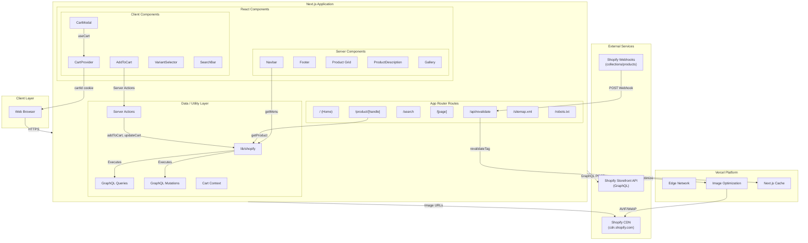

# Technology Architecture

## Overview

Next.js Commerce is a headless storefront application that serves as the presentation layer for Shopify-powered ecommerce. The application runs on Vercel's Edge Network and communicates directly with the Shopify Storefront API to fetch and manage products, collections, cart state, and pages.

## Architecture Diagram

## Component Descriptions

### Runtime Environment

| Component | Technology | Evidence |
|-----------|------------|----------|
| Runtime | Node.js (via Vercel) | `next.config.ts`, package.json scripts |
| Framework | Next.js 15.6.0-canary.60 | package.json dependency |
| UI Library | React 19.0.0 | package.json dependency |
| Language | TypeScript 5.8.2 | tsconfig.json, package.json |
| Deployment | Vercel Edge Network | README.md, next.config.ts experimental features |

### Client/Presentation Layer

| Component | Technology | Evidence |
|-----------|------------|----------|
| Styling | Tailwind CSS 4.0.14 | package.json, postcss.config.mjs, globals.css |
| Icons | Heroicons React 2.2.0 | imports in modal.tsx, navbar components |
| UI Primitives | Headless UI React 2.2.0 | Dialog, Transition in cart-modal.tsx |
| Toast Notifications | Sonner 2.0.1 | Toaster in layout.tsx |
| Font | Geist Sans | GeistSans import, CSS variable in layout.tsx |
| Image Optimization | Next.js Image | next/image imports, next.config.ts remotePatterns |

### Data/Fetching Layer

| Component | Technology | Evidence |
|-----------|------------|----------|
| External API | Shopify Storefront API | lib/shopify/index.ts GraphQL calls |
| GraphQL Endpoint | `/api/2023-01/graphql.json` | lib/constants.ts |
| API Authentication | Storefront Access Token | X-Shopify-Storefront-Access-Token header |
| Query Layer | Custom GraphQL client | `shopifyFetch` function in lib/shopify/index.ts |
| GraphQL Fragments | Inline GraphQL | lib/shopify/fragments/*.ts |
| GraphQL Queries | Product, Cart, Collection, Menu, Page | lib/shopify/queries/*.ts |
| GraphQL Mutations | Cart operations | lib/shopify/mutations/cart.ts |

### State Management

| Component | Technology | Evidence |
|-----------|------------|----------|
| Server State | React Server Components + Next.js Cache | `"use cache"` directives in lib/shopify/index.ts |
| Client State | React Context + `useOptimistic` | CartProvider in cart-context.tsx |
| Cart Persistence | Browser Cookies | `cartId` cookie in actions.ts |
| Optimistic Updates | React `useOptimistic` | `useOptimistic` in cart-context.tsx |
| Cache Tags | Next.js Tag‑based Revalidation | `cacheTag()` calls in lib/shopify/index.ts |

### API/Revalidation Layer

| Component | Technology | Evidence |
|-----------|------------|----------|
| Revalidation Endpoint | `/api/revalidate` route | `app/api/revalidate/route.ts` |
| Webhook Authentication | Secret token validation | `SHOPIFY_REVALIDATION_SECRET` check |
| Revalidation Triggers | Shopify collection/product webhooks | `revalidate()` function in lib/shopify/index.ts |
| Supported Webhooks | `products/*`, `collections/*` | topic list in `revalidate()` function |

## Data Flow

### Product Browsing Flow

1. User requests `/product/[handle]`.
2. Server Component `app/product/[handle]/page.tsx` calls `getProduct(handle)`.
3. `lib/shopify/index.ts` executes GraphQL query against Shopify Storefront API.
4. Product data is reshaped to internal types and cached with `cacheTag(TAGS.products)`.
5. Response rendered as React Server Component.
6. Product images served from Shopify CDN via Next.js Image Optimization (AVIF/WebP).

### Cart Operations Flow

1. User clicks “Add to Cart” on product page.
2. `AddToCart` component triggers server action `addItem()`.
3. Server action reads `cartId` from cookies.
4. If no cart exists, `createCart()` creates new cart and sets cookie.
5. `addToCart()` mutation sent to Shopify Storefront API.
6. Optimistic update applied to cart state via `useOptimistic`.
7. Cart modal displays with updated items.
8. User redirected to Shopify checkout via `redirectToCheckout()`.

### Cache Revalidation Flow

1. Shopify fires webhook to `/api/revalidate` on product/collection changes.
2. Webhook validated using `SHOPIFY_REVALIDATION_SECRET`.
3. `revalidateTag()` called with appropriate tag (`products` or `collections`).
4. Next.js invalidates cached data.
5. Next request fetches fresh data from Shopify API.

## Communication Patterns

| Pattern | Technology | Evidence |
|---------|------------|----------|
| API Communication | HTTPS/GraphQL | `shopifyFetch` in `lib/shopify/index.ts` |
| Image Delivery | CDN with Optimization | `next.config.ts`, `next/image` component |
| State Updates | Server Actions + React State | `"use server"` in `actions.ts`, `useOptimistic` |
| Cookie Access | Next.js `cookies()` | `cookies().get/set` in `lib/shopify/index.ts` |
| Header Access | Next.js `headers()` | `headers().get()` for webhook topic |

## Environment Configuration

| Variable | Purpose | Evidence |
|----------|---------|----------|
| `SHOPIFY_STORE_DOMAIN` | Shopify store URL | `lib/shopify/index.ts` |
| `SHOPIFY_STOREFRONT_ACCESS_TOKEN` | API authentication | `lib/shopify/index.ts` |
| `SHOPIFY_REVALIDATION_SECRET` | Webhook validation | `app/api/revalidate/route.ts` |
| `COMPANY_NAME` | Footer copyright | `app/layout.tsx`, `components/layout/footer.tsx` |
| `SITE_NAME` | Site title | `app/layout.tsx`, `components/layout/navbar/index.tsx` |
| `VERCEL_PROJECT_PRODUCTION_URL` | Production domain | `lib/utils.ts` |

## Caching Strategy

| Resource | Cache Duration | Evidence |
|----------|----------------|----------|
| Products | `"days"` via `cacheLife` | `lib/shopify/index.ts` `getProduct()` |
| Collections | `"days"` via `cacheLife` | `lib/shopify/index.ts` `getCollection()` |
| Cart | `"seconds"` via `cacheLife` | `lib/shopify/index.ts` `getCart()` |
| Menu | `"days"` via `cacheLife` | `lib/shopify/index.ts` `getMenu()` |
| Revalidation | On‑demand via webhooks | `app/api/revalidate/route.ts` |

## Component Architecture

### Server Components (Default)

- `app/layout.tsx` – Root layout with `CartProvider`
- `app/page.tsx` – Homepage
- `app/product/[handle]/page.tsx` – Product detail page
- `app/search/page.tsx` – Search results
- `app/search/[collection]/page.tsx` – Collection pages
- `app/[page]/page.tsx` – Static pages
- `components/layout/navbar/index.tsx` – Navigation
- `components/layout/footer.tsx` – Footer
- `components/product/product-description.tsx` – Product info
- `components/grid/*` – Product grids

### Client Components (`"use client"`)

| Component | Purpose | Evidence |
|-----------|---------|----------|
| `CartModal` | Shopping cart drawer | `components/cart/modal.tsx` |
| `CartProvider` | Cart state management | `components/cart/cart-context.tsx` |
| `AddToCart` | Add to cart form | `components/cart/add-to-cart.tsx` |
| `VariantSelector` | Product variant selection | `components/product/variant-selector.tsx` |
| `Gallery` | Product image gallery | `components/product/gallery.tsx` |
| `SearchBar` | Product search | `components/layout/navbar/search.tsx` |
| `MobileMenu` | Mobile navigation | `components/layout/navbar/mobile-menu.tsx` |
| `FooterMenu` | Footer navigation | `components/layout/footer-menu.tsx` |

### Server Actions (`"use server"`)

| Function | Purpose | Evidence |
|----------|---------|----------|
| `addItem` | Add item to cart | `components/cart/actions.ts` |
| `removeItem` | Remove item from cart | `components/cart/actions.ts` |
| `updateItemQuantity` | Update cart item quantity | `components/cart/actions.ts` |
| `createCartAndSetCookie` | Initialize cart | `components/cart/actions.ts` |
| `redirectToCheckout` | Redirect to Shopify checkout | `components/cart/actions.ts` |

## Known Architectural Constraints

- **Single‑tenant deployment**: Repository is a template; production deployments require individual Shopify store configuration.
- **No database**: All product/cart data stored in Shopify; application is stateless.
- **No authentication layer**: Shopify handles customer authentication via Storefront API.
- **No payment processing**: Payments handled by Shopify checkout redirect.
- **Limited offline support**: Relies on network connectivity to Shopify API.
- **Vendor lock‑in**: GraphQL queries tightly coupled to Shopify Storefront API schema.

## Evidence Sources

- `package.json` – Dependencies and scripts  
- `lib/shopify/index.ts` – Core Shopify API integration  
- `lib/shopify/queries/*.ts` – GraphQL query definitions  
- `lib/shopify/mutations/cart.ts` – Cart mutation definitions  
- `lib/shopify/types.ts` – TypeScript type definitions  
- `components/cart/actions.ts` – Server actions for cart operations  
- `components/cart/cart-context.tsx` – Client‑side cart state management  
- `app/api/revalidate/route.ts` – Webhook endpoint for cache invalidation  
- `next.config.ts` – Next.js configuration including image optimization  
- `app/globals.css` – Global styles and Tailwind configuration  
- `.env.example` – Required environment variables  
- `README.md` – Documentation and deployment instructions