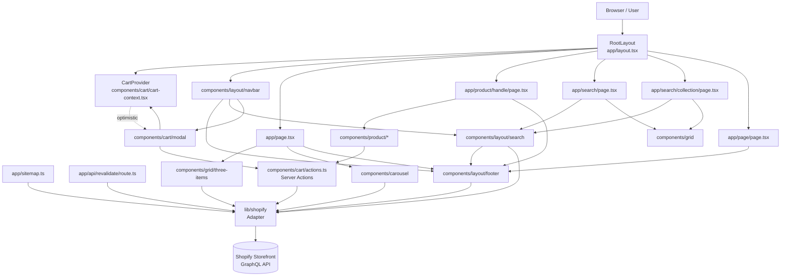

# High-Level Design

## Purpose and Scope

This document describes the logical organization of Next.js Commerce, a server-rendered ecommerce storefront built on Next.js 15 (App Router), React 19, TypeScript, and the Shopify Storefront API. The Technology Architecture phase established the runtime and technology boundaries; this phase explains the major logical components inside those boundaries, their responsibilities, their collaborations, and the workflows that move through them.

The system is structured so that the data provider (Shopify) is replaceable through a single module (`lib/shopify`). Everything else — pages, components, caching, the cart — is designed to remain stable when an alternative provider is plugged in.

---

## Major Logical Components

The logical design consists of seven major components. They are grouped by directory and identified by their responsibility, not merely their folder name.

### 1. Application Shell (`app/`)

The Next.js App Router root that defines the URL surface, the root layout, the per-route layouts, the error boundary, and the route handlers.

Responsibilities:
- Define routes for the storefront: `/` (home), `/search` and `/search/[collection]` (search and collection browsing), `/product/[handle]` (product detail), `/[page]` (CMS-driven pages), and the webhook endpoint `/api/revalidate`.
- Establish the document structure (`app/layout.tsx`), SEO defaults (`metadata`), and the visual frame (global styles, Toaster, WelcomeToast).
- Provide route-segment layouts (`app/[page]/layout.tsx`, `app/search/layout.tsx`) that compose the search experience and CMS page experience.
- Provide route conventions for search-engine artifacts: `app/sitemap.ts`, `app/robots.ts`, and the per-page `opengraph-image.tsx` files.
- Expose the single webhook endpoint used by the data provider to invalidate cached content.

Direct dependencies: `components/cart/cart-context`, `components/layout/navbar`, `lib/shopify`, `lib/utils`, `lib/constants`.

### 2. Provider Adapter Layer (`lib/shopify/`)

The single integration boundary with the external commerce system. This layer is the only place that knows how to talk to a provider.

Subcomponents:
- `lib/shopify/index.ts` — the public API of the adapter. Exports the request primitive (`shopifyFetch`) and the domain operations (cart, collections, products, menus, pages).
- `lib/shopify/queries/` — GraphQL query documents (cart, collection, menu, page, product).
- `lib/shopify/mutations/` — GraphQL mutation documents (cart create/add/update/remove).
- `lib/shopify/fragments/` — reusable GraphQL fragments (cart, image, product, seo).
- `lib/shopify/types.ts` — TypeScript types for the raw (`Shopify*`) and reshaped (`Product`, `Cart`, `Collection`, `Page`, `Menu`) domain objects, and the operation result types.
- `lib/shopify/queries/collection.ts` and `lib/shopify/queries/page.ts` — co-located `collectionFragment` and `pageFragment` definitions (not under `fragments/`).

Responsibilities:
- Translate between the provider's GraphQL schema and the application's reshaped domain types.
- Inject authentication via the Storefront access token.
- Expose domain operations whose signatures do not leak provider-specific shapes.
- Declare cache scope and lifetime for read operations using the Next.js `"use cache"` directive, `cacheTag`, and `cacheLife`.
- Surface provider errors as a typed object that the application can render.
- Host the revalidation handler that maps provider webhook topics to cache tags.

### 3. Read Workflows — Server-Rendered Pages

Each page in `app/` is a Next.js React Server Component that awaits data, then composes presentation components. The pages are thin orchestrators: they call provider operations, derive URL/SEO metadata, and render.

Pages and their data sources:

| Route | File | Primary data | Notes |
|---|---|---|---|
| `/` | `app/page.tsx` | `getCollectionProducts({ collection: "hidden-homepage-featured-items" })`, `getCollectionProducts({ collection: "hidden-homepage-carousel" })` | Three-tile grid + horizontally scrolling carousel. |
| `/product/[handle]` | `app/product/[handle]/page.tsx` | `getProduct`, `getProductRecommendations` | Emits a `Product` JSON-LD structured-data block. |
| `/search` | `app/search/page.tsx` | `getProducts({ query, sortKey, reverse })` | Sort derived from `sort` query parameter. |
| `/search/[collection]` | `app/search/[collection]/page.tsx` | `getCollection`, `getCollectionProducts` | Validates the collection exists; otherwise `notFound()`. |
| `/[page]` | `app/[page]/page.tsx` | `getPage` | Renders CMS body as HTML. |
| `/sitemap.xml` | `app/sitemap.ts` | `getCollections`, `getProducts`, `getPages` | Concatenates routes into a sitemap. |
| `/api/revalidate` | `app/api/revalidate/route.ts` | Provider webhook | Delegates to `revalidate` in the adapter. |

Per-page `generateMetadata` functions derive SEO title, description, OpenGraph fields, and `robots` directives from the same provider data the page body uses.

### 4. Cart Subsystem (`components/cart/`)

The cart spans the server and the client and is the most interaction-rich part of the system.

Subcomponents and roles:
- `components/cart/cart-context.tsx` — the client-side cart provider. Uses React 19's `use(context.cartPromise)` to resolve the initial cart passed in from the server, then `useOptimistic` with a `cartReducer` to apply local mutations immediately.
- `components/cart/actions.ts` — Server Actions (`"use server"`) for every cart mutation: `addItem`, `removeItem`, `updateItemQuantity`, `redirectToCheckout`, `createCartAndSetCookie`. Each calls the adapter, then calls `updateTag(TAGS.cart)` so cached cart views are invalidated.
- `components/cart/add-to-cart.tsx` — client form that derives the selected variant from URL search params, applies the optimistic `ADD_ITEM` action, then invokes the server action.
- `components/cart/modal.tsx` — the slide-in cart drawer. Coordinates `useCart`, auto-opens on quantity changes, manages the `createCartAndSetCookie` lifecycle, and exposes the checkout form that calls `redirectToCheckout`.
- `components/cart/delete-item-button.tsx` and `edit-item-quantity-button.tsx` — small client forms that pair an optimistic update with the corresponding server action.
- `components/cart/open-cart.tsx` — presentational icon-button with badge count.

Responsibilities split:
- Client: optimistic state, instant UI feedback, navigation, local cart UI state.
- Server: authoritative state on the provider, cookie-based cart identity, cache invalidation.
- Boundary: Server Actions receive the `selectedVariantId`/`merchandiseId` and return either a result or a string error message that the form renders into an `aria-live` region.

### 5. Catalog Presentation (`components/grid/`, `components/product/`)

The reusable building blocks for displaying products.

- `components/grid/index.tsx` — `Grid` and `Grid.Item` compound component, a typed `ul`/`li` pair with Tailwind grid utilities.
- `components/grid/tile.tsx` — `GridTileImage`, the standard product image card with optional label.
- `components/grid/three-items.tsx` — featured-items section for the homepage, driven by the `hidden-homepage-featured-items` collection.
- `components/product/gallery.tsx` — client component that drives a single-image viewer with prev/next controls and thumbnails using the `image` URL parameter for state.
- `components/product/variant-selector.tsx` — client component that maps each option/value to a button, computes availability per combination, and writes the selection back to the URL as search params.
- `components/product/product-description.tsx` — server component that composes price, variant selector, prose, and the add-to-cart form.

### 6. Site Chrome (`components/layout/`)

Persistent layout and navigation, fetched at request time from the provider.

- `components/layout/navbar/index.tsx` — server component. Fetches the header menu, then composes `LogoSquare`, header menu links, `Search` (client, suspense-wrapped), and `CartModal`.
- `components/layout/navbar/mobile-menu.tsx` — client slide-in menu with the same `Search` instance.
- `components/layout/navbar/search.tsx` — client form using `next/form` that GETs `/search` with a `q` parameter.
- `components/layout/footer.tsx` — server component that fetches the footer menu.
- `components/layout/footer-menu.tsx` — client component that highlights the active item via `usePathname`.
- `components/layout/search/collections.tsx` — server component that wraps the collections list in a `Suspense` boundary with a skeleton fallback.
- `components/layout/search/filter/index.tsx`, `dropdown.tsx`, `item.tsx` — filter list that supports two item shapes: a `PathFilterItem` (collections navigation) and a `SortFilterItem` (sorting options).
- `components/layout/product-grid-items.tsx` — presentational component that maps a list of `Product`s to `Grid.Item` cells with `GridTileImage`.

### 7. Shared Utilities and Constants

- `lib/constants.ts` — domain constants: `TAGS` (cache tag identifiers), `HIDDEN_PRODUCT_TAG` (product tag that excludes items), `DEFAULT_OPTION` (default variant title), `SHOPIFY_GRAPHQL_API_ENDPOINT`, and the `sorting` array used by both the search and collection pages.
- `lib/type-guards.ts` — `isObject` and `isShopifyError` runtime checks used inside the adapter's error path.
- `lib/utils.ts` — `baseUrl` (production or localhost), `createUrl` (pathname + query string composer used throughout the filter and search UI), `ensureStartsWith` (used to normalize the store domain), and `validateEnvironmentVariables` (used by the sitemap).
- `components/label.tsx`, `components/price.tsx`, `components/prose.tsx`, `components/logo-square.tsx`, `components/loading-dots.tsx`, `components/carousel.tsx`, `components/welcome-toast.tsx` — small presentational components reused across pages.

---

## Interface Contracts Between Components

### Server-to-Adapter Contract

The application calls a fixed set of exported functions in `lib/shopify`. Each function takes simple JS values and returns a reshaped domain object. Examples:

- `getProduct(handle: string): Promise<Product | undefined>`
- `getProducts({ query?, sortKey?, reverse? }): Promise<Product[]>`
- `getCollection(handle: string): Promise<Collection | undefined>`
- `getCollections(): Promise<Collection[]>`
- `getCollectionProducts({ collection, sortKey?, reverse? }): Promise<Product[]>`
- `getMenu(handle: string): Promise<Menu[]>`
- `getPage(handle: string): Promise<Page>`
- `getCart(): Promise<Cart | undefined>`
- `createCart(): Promise<Cart>`
- `addToCart(lines): Promise<Cart>`
- `updateCart(lines): Promise<Cart>`
- `removeFromCart(lineIds): Promise<Cart>`
- `revalidate(req: NextRequest): Promise<NextResponse>` (called by the webhook route)

Mutating operations do not accept cart id as an explicit argument; they read the `cartId` cookie via `next/headers`. This keeps call sites simple but ties the adapter to a cookie-based cart identity.

### Cart Action Contract

Server Actions follow a uniform `(prevState, payload) => result` signature suitable for React's `useActionState`. They return either `undefined` on success or a human-readable string error that the calling form renders into an `aria-live` region.

### Client Cart Context Contract

`useCart()` returns `{ cart, addCartItem, updateCartItem }`. The reducer accepts two action shapes: `ADD_ITEM { variant, product }` and `UPDATE_ITEM { merchandiseId, updateType: "plus"|"minus"|"delete" }`. The provider receives `cartPromise` from the server and resolves it through React's `use()`.

### URL Contract

- Search and collection pages consume `?q=...&sort=...&image=...&{option}=...` query parameters.
- The product page derives the selected variant by reading one URL parameter per option (lowercased option name).
- `createUrl` is the single helper used to compose URLs that preserve or strip query parameters.

### Provider GraphQL Contract

The adapter speaks the Shopify Storefront API at the versioned endpoint constant `SHOPIFY_GRAPHQL_API_ENDPOINT` ("/api/2023-01/graphql.json"), authenticated with the `X-Shopify-Storefront-Access-Token` header. All responses are typed through `Shopify*Operation` types and reshaped before being returned to callers.

---

## Component Collaboration and Dependency Direction

The dependency direction is strictly inward: pages and components depend on the adapter and on each other, but the adapter does not depend on pages or components.

```
app/* (RSC pages and route handlers)
   |
   +--> components/layout/*, components/grid/*, components/product/*, components/cart/*
   |       |
   |       +--> components/cart/actions.ts (Server Actions)
   |       |       |
   |       |       +--> lib/shopify (provider adapter)
   |       |       +--> next/cache (updateTag)
   |       |       +--> next/headers (cookies)
   |       |
   |       +--> components/cart/cart-context (Client Provider, useOptimistic)
   |
   +--> lib/shopify (provider adapter)
   |
   +--> lib/constants, lib/utils, lib/type-guards
   |
   +--> next/* (App Router primitives)
```

- The adapter has no React or Next.js UI dependencies; it only uses `next/cache`, `next/headers`, and `next/server` for non-UI concerns (cache directives, cookie access, and the webhook `NextRequest`/`NextResponse`).
- Server Components are leaves from the adapter's perspective: they `await` adapter functions and render.
- Client Components (`use client`) are confined to `components/cart/*`, `components/layout/navbar/*`, `components/layout/footer-menu.tsx`, `components/layout/search/filter/*`, `components/product/gallery.tsx`, `components/product/variant-selector.tsx`, `components/welcome-toast.tsx`, and `app/search/children-wrapper.tsx`.
- The split between client and server components is determined by the need for browser-only state or event handlers: optimistic cart, form submission, hover-driven UI, dialog visibility, URL-driven interactivity.

No circular dependencies exist between the adapter and the UI layer. The `lib/utils.ts` and `lib/constants.ts` modules are leaf utilities consumed by both layers without depending on either.

---

## Request and Data Flows

The following workflows illustrate how state and control move through the components.

### Home Page Render

`app/page.tsx` → `ThreeItemGrid` (Server Component) → `getCollectionProducts({ collection: "hidden-homepage-featured-items" })` → adapter reads from cache (or provider if cold) → reshape → render `ThreeItemGridItem` for each product → continue to `Carousel` (Server Component) → `getCollectionProducts({ collection: "hidden-homepage-carousel" })` → render the carousel list → `Footer` (Server Component) → `getMenu("next-js-frontend-footer-menu")` → `FooterMenu`.

The data is fetched in parallel where the layout allows it. Each segment may independently use `Suspense` (`collections.tsx` does so for the search filters).

### Product Detail Page Render

`app/product/[handle]/page.tsx` → `generateMetadata` derives SEO from the same `getProduct(handle)` call the body uses (no double fetch in the common case) → the page awaits `getProduct(handle)` and `getProductRecommendations(productId)` is awaited inside the body via the `RelatedProducts` async function → the page composes a `Gallery` (client) and `ProductDescription` (server) under `Suspense` boundaries → `Gallery` reads `image` from the URL; `ProductDescription` renders `VariantSelector` (client) → `AddToCart` (client).

### Add to Cart

1. User selects a variant. `VariantSelector` writes the option value to the URL.
2. `AddToCart` derives `selectedVariantId` from the URL, then its form action first calls `addCartItem(variant, product)` (client, optimistic via `useOptimistic` → `cartReducer` `ADD_ITEM`), then invokes the bound Server Action `addItem`.
3. The Server Action calls `addToCart([{ merchandiseId, quantity: 1 }])` in the adapter, which POSTs the `addToCartMutation` to the provider with the `cartId` cookie.
4. The action calls `updateTag(TAGS.cart)` so any cached `getCart()` result is invalidated.
5. React Server Components re-render the `RootLayout`'s `CartProvider` consumers, including the modal and the open-cart badge.

### Cart Edit and Checkout

`EditItemQuantityButton` and `DeleteItemButton` mirror the same pattern: optimistic update through the reducer, then a Server Action that uses `getCart` to resolve the line id, then a provider call, then `updateTag(TAGS.cart)`.

`redirectToCheckout` reads the current `cart` and uses Next.js `redirect` to the provider-supplied `checkoutUrl`. No checkout pages exist in the application — checkout is delegated to the provider.

### Search and Collection Browse

`/search` reads `q` and `sort` from the URL, resolves the sort to `{ sortKey, reverse }` via the `sorting` array, calls `getProducts`, and renders the grid. `/search/[collection]` adds `getCollection` for the title/SEO and uses `getCollectionProducts` instead. The `search/layout.tsx` wraps both with a `ChildrenWrapper` (client) that forces a re-render of the children when the `q` param changes.

### CMS Page

`/[page]` reads the handle from the URL, calls `getPage(handle)`, and renders `page.title` plus a `Prose` block for the HTML body. If the page is missing, `notFound()` is returned.

### Webhook Revalidation

The provider POSTs to `/api/revalidate` with a `x-shopify-topic` header and a `secret` query parameter. The route handler delegates to `revalidate(req)`, which validates the secret, identifies the topic, and calls `revalidateTag(TAGS.collections, "seconds")` or `revalidateTag(TAGS.products, "seconds")` accordingly. The handler always returns HTTP 200 to prevent provider retries.

---

## State Ownership and Lifecycle

| State | Owner | Lifetime | Persistence |
|---|---|---|---|
| Catalog data (products, collections, pages, menus) | Provider | Cached for `days` via `cacheLife("days")` and tagged with `TAGS.products` / `TAGS.collections` | Re-fetched from provider on cache miss or after webhook revalidation |
| Cart identity (`cartId`) | Browser cookie, read by adapter via `next/headers` | Per visitor, persistent until checkout completes | Cookie is the only source; no server-side cart storage |
| Cart content (lines, totals) | Provider | Server Action mutations + cached `getCart` for `seconds` via `cacheLife("seconds")` and `TAGS.cart` | Re-fetched from provider; cache invalidated by `updateTag(TAGS.cart)` |
| Cart UI state (modal open, item additions) | Client (`useState` in `CartModal`, `useOptimistic` in `CartProvider`) | Single session | Lost on reload |
| Search/sort/option selection | URL search params | Per request | Reconstructed from URL on each request |
| Footer/header menus | Provider | Cached for `days` | Same as catalog |
| Welcome-toast dismissal | Browser cookie | Long-lived (`max-age=31536000`) | Cookie-based, never sent to server |

State transitions that cross boundaries:
- User action → client optimistic reducer → Server Action → provider mutation → `updateTag` → revalidation of cached `getCart` → Server Components re-render with fresh data.
- Provider webhook → `/api/revalidate` route handler → `revalidateTag` → cached read operations re-execute on next request.

---

## Synchronous and Asynchronous Boundaries

All data fetches in pages and the cart are asynchronous. The system uses three distinct async patterns:

1. **Plain async/await on the server**: page bodies and Server Components `await` adapter functions.
2. **Promise streaming into a client provider**: `app/layout.tsx` calls `getCart()` without awaiting and passes the resulting `Promise<Cart | undefined>` to `CartProvider`, which resolves it via `React.use()`. This avoids a server-client waterfall for the initial cart.
3. **Suspense streaming**: `collections.tsx`, `search/layout.tsx`, the product page's gallery, and the navbar's `Search` are wrapped in `Suspense` so the rest of the page can stream ahead while data resolves. The `search/loading.tsx` route-level `Loading` component provides a skeleton for the search route.

There are no background workers, message queues, scheduled jobs, or polling loops in the application. All long-running concerns (cache invalidation, checkout) are delegated to the provider or to Next.js infrastructure.

---

## Caching Design

The system uses Next.js's `"use cache"` directive with `cacheTag` and `cacheLife` to scope caching per data shape.

| Operation | Cache scope | Lifetime | Tag(s) |
|---|---|---|---|
| `getCart` | Private (per request) | `seconds` | `TAGS.cart` |
| `getProduct` | Public | `days` | `TAGS.products` |
| `getProducts` | Public | `days` | `TAGS.products` |
| `getProductRecommendations` | Public | `days` | `TAGS.products` |
| `getCollection` | Public | `days` | `TAGS.collections` |
| `getCollectionProducts` | Public | `days` | `TAGS.collections`, `TAGS.products` |
| `getCollections` | Public | `days` | `TAGS.collections` |
| `getMenu` | Public | `days` | `TAGS.collections` |
| `getPage` / `getPages` | Not cached | — | — |

Mutating cart actions and the webhook endpoint invalidate by tag. `next.config.ts` enables `experimental.useCache` and `experimental.ppr` so that the directive is honored and partial prerendering can be used.

---

## Error and Failure Propagation

Architectural failure paths:

- **Provider request failure**: `shopifyFetch` catches errors and either re-throws a typed `{ cause, status, message, query }` object (when the error matches `isShopifyError`) or a generic `{ error, query }` object. Page bodies render the route's `error.tsx` boundary when an exception escapes; the user sees the global error message with a "Try Again" reset button.
- **Missing resource**: pages return `notFound()` from `next/navigation` for unknown products, collections, and pages. This renders Next.js's default 404 view.
- **Missing `SHOPIFY_STORE_DOMAIN` or access token**: `shopifyFetch` throws immediately on missing domain. `validateEnvironmentVariables` is called by `app/sitemap.ts` to fail fast when the sitemap is requested.
- **Unconfigured provider**: catalog read operations degrade gracefully — `getCollectionProducts`, `getCollections`, `getMenu`, and `getProduct` log a skip message and return a synthetic single-item collection (or empty array) so that the storefront can still render in development or in a demo state.
- **Cart operation failure**: Server Actions catch exceptions and return a string error; the form renders it in an `aria-live="polite"` region so the failure is announced without disrupting the optimistic UI.
- **Webhook authentication failure**: `revalidate` returns HTTP 401 when the `secret` parameter does not match. The handler always returns 200 for non-collection/non-product topics to prevent provider-side retries.
- **Checkout**: `redirectToCheckout` calls `redirect(cart.checkoutUrl)` and assumes the URL is present. The cart is fetched lazily and not awaited in a way that would block page render; if checkout is invoked with no cart, the non-null assertion in the action would throw.

---

## Design Patterns Observed

- **Adapter pattern**: `lib/shopify` isolates the provider behind a stable function API. The README explicitly states that alternative providers should replace this single module.
- **Server-Component data fetching**: pages fetch on the server and pass plain data into client components, removing the need for client-side data libraries.
- **Optimistic UI with `useOptimistic`**: the cart reducer applies mutations locally and reconciles when the Server Action returns and the cached `getCart` re-runs.
- **Server Actions for mutations**: every cart mutation is a `"use server"` function invoked from a client form, with `useActionState` providing a uniform error/result channel.
- **Suspense streaming**: large or slow data fetches are isolated inside `Suspense` boundaries (search filters, footer menu, product gallery) so unrelated content streams ahead.
- **Compound component**: `Grid` and `Grid.Item` form a typed compound component for product grids.
- **Fragment-routed SEO**: `generateMetadata` on each page derives SEO from the same data the body uses, with `robots` honoring a hidden-product tag.
- **URL-as-state**: option selection (`VariantSelector`), gallery position (`Gallery`), search query, and sort are all stored in the URL, making the UI bookmarkable and shareable.
- **Cache-tag invalidation**: provider webhooks map to cache tags rather than to specific URLs, allowing one webhook to invalidate every cached read of that kind.

---

## Coupling and Cohesion Notes

- The cart subsystem is the only area with significant client/server interleaving. It is the most cohesive: all cart UI lives in `components/cart/`, all server-side cart work lives in the same `actions.ts`, and the provider is consumed through a single context.
- The adapter is cohesive and dependency-light. It is the only place that imports GraphQL documents, the only place that constructs provider URLs, and the only place that uses `next/headers` cookies for the cart id.
- `lib/utils.ts` exports `validateEnvironmentVariables` but only `app/sitemap.ts` calls it. The other entry points rely on the adapter's internal checks instead, so the explicit validator is not enforced for all routes.
- The `lib/shopify/queries/page.ts` and `lib/shopify/queries/collection.ts` files define fragments inline (`pageFragment`, `collectionFragment`) rather than under `lib/shopify/fragments/`, while `lib/shopify/fragments/` contains `cart.ts`, `image.ts`, `product.ts`, and `seo.ts`. This is a minor organizational inconsistency: the fragment-organization contract is partially followed.
- `lib/shopify/types.ts` defines both the raw `Shopify*` types and the reshaped application types (`Product`, `Cart`, `Collection`). This means the same module owns the data contract at two layers of abstraction, which is acceptable for a single-provider template but would warrant separation if multiple provider shapes were supported simultaneously.
- The `carousel.tsx` and `three-items.tsx` components in `components/` are not part of the `grid/` directory, even though they consume `GridTileImage` and behave like grid sections. They are placed at the top of `components/` because they orchestrate a section rather than implement a grid primitive.
- `app/[page]/page.tsx` and `app/[page]/layout.tsx` resolve CMS pages from Shopify. The static `app/page.tsx` (home) does not use this route; it composes its own sections. There is no risk of collision because `/[page]` matches only paths that are not consumed by the more specific routes.

---

## Reconciliation of Intended and Implemented Design

- The README states the project is a "high-performance, server-rendered Next.js App Router ecommerce application" using "React Server Components, Server Actions, `Suspense`, `useOptimistic`". The implementation matches this across pages, cart actions, and the layout. The exceptions are small interactive widgets (`MobileMenu`, `FooterMenu`, `Gallery`, `VariantSelector`, `Search`, `FilterItemDropdown`) that are correctly scoped to client components.
- The provider-swap intent in the README is supported by the adapter's design: every page and component imports from `lib/shopify` rather than from a Shopify-specific package. A provider fork would need to preserve the exported function signatures and the reshaped types.
- The `experimental.useCache` flag in `next.config.ts` is the mechanism that activates the `"use cache"` directive in the adapter. The implementation depends on this flag, so the configuration and the code are consistent.
- The `HIDDEN_PRODUCT_TAG` constant is consumed in `reshapeProduct` and in the product page's `robots` derivation. The same naming convention is used for `hidden-*` collections, which are filtered out of `getCollections` and used to drive the homepage's featured-items grid and the homepage carousel. This consistent "hidden-*" convention is documented inline in `getCollections`, `three-items.tsx`, and `carousel.tsx`.
- `validateEnvironmentVariables` is only called from the sitemap route. Page-level and cart operations rely on the adapter's own domain check. This is a partial implementation of the README's intent that "your site will not work without" the required environment variables; in practice, many routes still render (with degraded data) when the variables are absent.
- The `redirectToCheckout` action is invoked by the cart modal but the modal itself is a client component, so the form's `action` is a server function invoked through a `useFormStatus` button. This pattern is consistent with the cart's overall client/server split.

---

## High-Level Component Diagram



---

## Verification Summary

- All major logical components identified have been traced to specific files and call sites.
- Representative workflows (home render, product detail, add-to-cart, edit quantity, search/collection, CMS page, webhook revalidation) have been traced end-to-end.
- Interfaces crossing component boundaries (adapter functions, Server Action signatures, `useCart()` shape, URL contract, GraphQL contract) have been enumerated from the implementation.
- Dependency direction is one-way: UI → adapter → provider. No cycles observed.
- State ownership and lifetimes have been mapped for catalog, cart, UI, and session concerns.
- Asynchronous behavior is limited to RSC fetches, Promise streaming into the cart context, and Suspense boundaries. No background workers or queues are present.
- Failure paths for missing resources, missing configuration, provider errors, and webhook authentication are handled at architectural boundaries.
- Named design patterns (adapter, optimistic UI, server actions, suspense streaming, compound component, cache-tag invalidation) are all evidenced by structural relationships in the code, not merely by folder names.
- The implementation matches the documented intent for a provider-swappable, server-rendered, optimistic-commerce template built on the Next.js App Router.