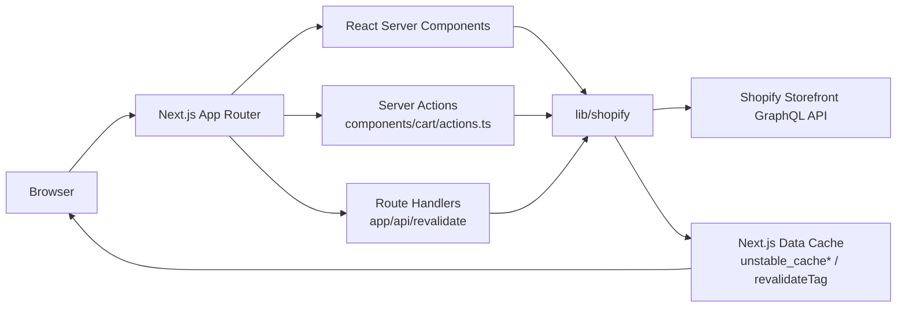
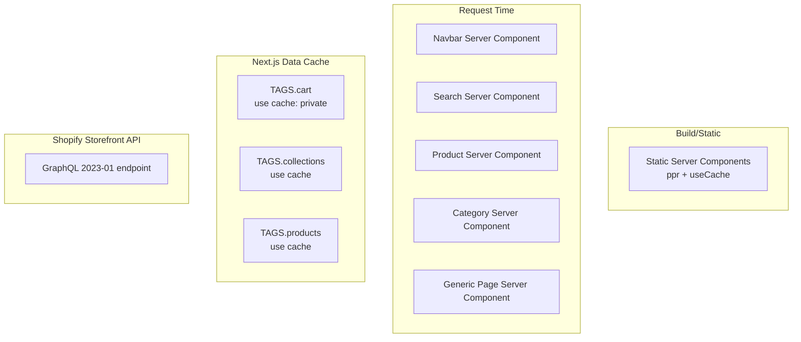

# Implementation Detail

## 1. Overview

Next.js Commerce (Vercel Commerce) is a single-package Next.js 15 application built on the App Router. The implementation is a server-rendered storefront that sources all catalog, cart, menu, and page data from a remote Shopify Storefront API instance, exposes that data through a thin TypeScript data layer in `lib/shopify/`, and renders it through a small set of React Server Components, Client Components, Server Actions, and route handlers.

The repository is intentionally structured so that the data layer is the only place bound to a specific commerce provider; the rest of the application code is provider-agnostic.



The application is delivered as a single Next.js app. There is no separate API server, no separate worker, and no database of its own; persistence is delegated entirely to Shopify. The cart identifier is the only piece of state stored in the browser, held in a `cartId` cookie.

---

## 2. Project Layout

The repository is a flat Next.js project with the App Router at the root. The `package.json` (`package.json:1-34`) defines four scripts and a small set of runtime and dev dependencies. The project is a `private` package and has no published artifacts.

| Top-level entry | Purpose | Evidence |
|---|---|---|
| `app/` | Next.js App Router root: layouts, pages, API routes, SEO assets | `app/layout.tsx`, `app/page.tsx` |
| `components/` | Reusable React components, grouped by domain (`cart/`, `grid/`, `layout/`, `product/`) | `components/cart/modal.tsx` |
| `lib/` | Data layer, constants, utilities, type guards | `lib/shopify/index.ts`, `lib/constants.ts` |
| `fonts/` | Local Inter Bold font for OpenGraph image generation | `fonts/Inter-Bold.ttf` |
| `next.config.ts` | Next.js configuration (experimental PPR, inline CSS, useCache, image domains) | `next.config.ts:1-17` |
| `tsconfig.json` | TypeScript compiler configuration (strict, `noUncheckedIndexedAccess`) | `tsconfig.json:1-34` |
| `postcss.config.mjs` | PostCSS pipeline (Tailwind CSS v4) | `postcss.config.mjs:1-6` |
| `.env.example` | Required environment variables | `.env.example:1-5` |
| `app/globals.css` | Global stylesheet with Tailwind import and plugins | `app/globals.css:1-32` |

The application uses path aliases that are resolved by `tsconfig.json` (`baseUrl: "."`):

- `components/*` resolves under `components/`
- `lib/*` resolves under `lib/`

These aliases are consumed throughout the codebase, e.g. `import { getCart } from "lib/shopify"` (`app/layout.tsx:5`), `import { Navbar } from "components/layout/navbar"` (`app/layout.tsx:2`).

---

## 3. Build, Tooling, and Runtime Configuration

### 3.1 Package and dependency manifest

`package.json` declares the project as private, with four scripts:

| Script | Command | Purpose |
|---|---|---|
| `dev` | `next dev --turbopack` | Local development with Turbopack bundler |
| `build` | `next build` | Production build |
| `start` | `next start` | Run the production build |
| `prettier` / `prettier:check` | `prettier --write --check --ignore-unknown .` | Formatting |
| `test` | `pnpm prettier:check` | Script named `test`, but executes only Prettier; there is no test runner |

Runtime dependencies (`package.json:11-20`):

- `next` 15.6.0-canary.60 (App Router with canary features)
- `react` 19.0.0, `react-dom` 19.0.0
- `@headlessui/react` 2.2.0 (Dialog, Transition primitives for cart and mobile menu)
- `@heroicons/react` 2.2.0 (icon set)
- `clsx` 2.1.1 (className composition)
- `geist` 1.3.1 (`GeistSans` font variable used in root layout)
- `sonner` 2.0.1 (toast notifications for `WelcomeToast`)

Development dependencies (`package.json:21-33`):

- `tailwindcss` 4.0.14 with `@tailwindcss/postcss`, `@tailwindcss/container-queries`, `@tailwindcss/typography`
- `postcss` 8.5.3
- `prettier` 3.5.3 and `prettier-plugin-tailwindcss` 0.6.11
- `typescript` 5.8.2 with `@types/node`, `@types/react`, `@types/react-dom`

The lockfile is `pnpm-lock.yaml`, indicating pnpm is the canonical package manager. The README instructs `pnpm install` and `pnpm dev`.

### 3.2 Next.js configuration

`next.config.ts` (TypeScript configuration file consumed by Next.js):

- Enables experimental `ppr` (Partial Prerendering) so that static shells can be streamed with dynamic holes.
- Enables `inlineCss` and `useCache` experimental flags used in combination with the `'use cache'` directive inside `lib/shopify`.
- Configures `images` to emit `image/avif` and `image/webp` and to load remote images from `cdn.shopify.com` under `/s/files/**`.

### 3.3 TypeScript configuration

`tsconfig.json` compiles the project with:

- `target: es2015`, `module/moduleResolution: esnext/node`
- `strict: true` and `noUncheckedIndexedAccess: true` (the codebase respects the latter, e.g. `image.url.match(/.*\/(.*)\..*/)?.[1]` in `lib/shopify/index.ts:176`)
- `jsx: "react-jsx"` (no React import required)
- `allowJs: true` so `.mjs` and any `.js` are accepted
- `plugins: [{ name: "next" }]` to enable Next.js TypeScript features
- Type acquisition includes `next-env.d.ts` and the auto-generated `.next/types/**/*.ts`

### 3.4 PostCSS and Tailwind

`postcss.config.mjs` registers only `@tailwindcss/postcss`.

`app/globals.css` is the single stylesheet. It:

- Imports Tailwind (`@import "tailwindcss";`)
- Registers the `@tailwindcss/container-queries` and `@tailwindcss/typography` plugins via `@plugin`
- Sets the default border color
- Applies a `prefers-color-scheme: dark` color scheme and a `focus-visible` ring style

### 3.5 Environment configuration

`.env.example` documents the required environment variables:

| Variable | Purpose |
|---|---|
| `COMPANY_NAME` | Footer copyright name |
| `SITE_NAME` | Title template (`%s | ${SITE_NAME}`) and default site title |
| `SHOPIFY_REVALIDATION_SECRET` | Shared secret required by the revalidation webhook (`app/api/revalidate/route.ts`) |
| `SHOPIFY_STOREFRONT_ACCESS_TOKEN` | Bearer-like token sent as `X-Shopify-Storefront-Access-Token` |
| `SHOPIFY_STORE_DOMAIN` | Storefront domain (e.g. `your-store.myshopify.com`) |

`lib/utils.ts:validateEnvironmentVariables` is the canonical validator. It enforces the presence of `SHOPIFY_STORE_DOMAIN` and `SHOPIFY_STOREFRONT_ACCESS_TOKEN`, and rejects the literal placeholder form `[your-shopify-store-subdomain]`. It is invoked from `app/sitemap.ts`.

`lib/utils.ts:baseUrl` derives the public base URL from `VERCEL_PROJECT_PRODUCTION_URL` or falls back to `http://localhost:3000`. It is used by `app/layout.tsx` (metadata), `app/robots.ts`, `app/sitemap.ts`, and `app/opengraph-image.tsx`.

---

## 4. Application Entry Points and Startup Path

There is no custom server entry. The Next.js runtime uses its own conventions.

### 4.1 Root layout

`app/layout.tsx:25-46` is the root layout. It:

- Reads `SITE_NAME` from `process.env`
- Defines site-wide `metadata` with `metadataBase`, a `template` title, and `robots: { follow: true, index: true }`
- Calls `getCart()` from `lib/shopify` *without awaiting* the result, passing the `Promise<Cart | undefined>` directly to `CartProvider` as `cartPromise` so that the cart fetch is initiated at the edge and resolved in parallel with the page render
- Renders the application shell: `<html lang="en" className={GeistSans.variable}>` with body styling for both light and dark modes, `CartProvider`, `<Navbar />`, `<main>{children}</main>`, `Toaster` from `sonner`, and the `<WelcomeToast />` component

### 4.2 Root page

`app/page.tsx:13-20` renders the home page composited from `<ThreeItemGrid />` (`components/grid/three-items.tsx`), `<Carousel />` (`components/carousel.tsx`), and `<Footer />` (`components/layout/footer.tsx`).

### 4.3 Route map

| Route | File | Rendering mode | Notes |
|---|---|---|---|
| `/` | `app/page.tsx` | Server Component | Composes featured items grid and carousel |
| `/search` | `app/search/page.tsx` | Server Component | Reads `q` and `sort` from search params; calls `getProducts` |
| `/search/[collection]` | `app/search/[collection]/page.tsx` | Server Component | Calls `getCollection` and `getCollectionProducts` |
| `/product/[handle]` | `app/product/[handle]/page.tsx` | Server Component | Renders gallery, description, related products |
| `/[page]` | `app/[page]/page.tsx` | Server Component | Generic CMS page route using `getPage` |
| `/api/revalidate` | `app/api/revalidate/route.ts` | Route Handler | POST endpoint for Shopify webhooks |
| `robots.txt` | `app/robots.ts` | Route Handler | Returns `MetadataRoute.Robots` |
| `sitemap.xml` | `app/sitemap.ts` | Route Handler | Returns `MetadataRoute.Sitemap`, marked `dynamic = "force-dynamic"` |
| OpenGraph image | `app/opengraph-image.tsx`, `app/search/[collection]/opengraph-image.tsx` | Route Handler | `ImageResponse` with Inter Bold font |

Loading and error boundaries are colocated in `app/`:

- `app/search/loading.tsx` renders a 12-cell animated skeleton grid.
- `app/error.tsx` is a Client Component that displays a recoverable error card with a `reset()` button.

---

## 5. Data Layer Implementation

The data layer is the only place bound to Shopify. It is implemented under `lib/shopify/` and exports a small surface of asynchronous functions consumed by Server Components and Server Actions.

### 5.1 Module structure

| File | Responsibility |
|---|---|
| `lib/shopify/index.ts` | GraphQL fetch wrapper, response reshaping, exported async data access functions, webhook revalidation handler |
| `lib/shopify/types.ts` | TypeScript types for raw and reshaped Shopify data, operation result shapes |
| `lib/shopify/queries/*` | GraphQL queries (cart, collection, menu, page, product) |
| `lib/shopify/mutations/cart.ts` | GraphQL mutations for cart lifecycle |
| `lib/shopify/fragments/*` | Reusable GraphQL fragments (cart, product, image, seo) |

### 5.2 GraphQL endpoint and authentication

`lib/shopify/index.ts:61-65` constructs the endpoint and the access token at module load:

```
const domain = process.env.SHOPIFY_STORE_DOMAIN ? ensureStartsWith(process.env.SHOPIFY_STORE_DOMAIN, "https://") : "";
const endpoint = domain ? `${domain}${SHOPIFY_GRAPHQL_API_ENDPOINT}` : "";
const key = process.env.SHOPIFY_STOREFRONT_ACCESS_TOKEN!;
```

`SHOPIFY_GRAPHQL_API_ENDPOINT` is the Storefront API path `'/api/2023-01/graphql.json'` declared in `lib/constants.ts:51`.

### 5.3 `shopifyFetch`

`shopifyFetch<T>` (`lib/shopify/index.ts:71-123`) is the only call site that hits Shopify. It:

- Throws immediately if `endpoint` is empty (i.e. `SHOPIFY_STORE_DOMAIN` not set)
- Issues a `POST` with `Content-Type: application/json` and `X-Shopify-Storefront-Access-Token: <key>`
- Serializes `{ query, variables }`
- Throws the first GraphQL error from `body.errors`
- Returns `{ status, body }`
- Catches unknown errors and rethrows them as a typed object using `isShopifyError` from `lib/type-guards.ts`

### 5.4 Reshaping

Raw Shopify responses use the Relay-style `edges { node }` connection pattern. The data layer flattens these into direct arrays and projects the shapes the application uses:

- `removeEdgesAndNodes<T>(array: Connection<T>): T[]` (`lib/shopify/index.ts:125-127`)
- `reshapeCart(cart: ShopifyCart): Cart` (`lib/shopify/index.ts:129-141`) – defaults `totalTaxAmount` to `0.0` in the cart's currency if missing
- `reshapeCollection(collection: ShopifyCollection): Collection | undefined` (`lib/shopify/index.ts:143-154`) – attaches a `path: '/search/<handle>'`
- `reshapeCollections(collections)` filters out undefined entries (`lib/shopify/index.ts:156-170`)
- `reshapeImages(images, productTitle)` flattens and falls back `altText` to `<title> - <filename>` (`lib/shopify/index.ts:172-182`)
- `reshapeProduct(product, filterHiddenProducts = true)` removes products tagged `nextjs-frontend-hidden` (the value of `HIDDEN_PRODUCT_TAG` in `lib/constants.ts:49`) and flattens images and variants (`lib/shopify/index.ts:184-202`)
- `reshapeProducts(products)` is the array wrapper for `reshapeProduct`

### 5.5 Caching and revalidation

The data layer uses Next.js's `'use cache'` directive (paired with the experimental `useCache` flag in `next.config.ts`) on most read functions to opt them into the Next.js Data Cache:

| Function | Cache mode | Cache tags | Cache life |
|---|---|---|---|
| `getCart` | `"use cache: private"` | `TAGS.cart` | `"seconds"` |
| `getCollection` | `"use cache"` | `TAGS.collections` | `"days"` |
| `getCollectionProducts` | `"use cache"` | `TAGS.collections`, `TAGS.products` | `"days"` |
| `getCollections` | `"use cache"` | `TAGS.collections` | `"days"` |
| `getMenu` | `"use cache"` | `TAGS.collections` | `"days"` |
| `getProduct` | `"use cache"` | `TAGS.products` | `"days"` |
| `getProductRecommendations` | `"use cache"` | `TAGS.products` | `"days"` |
| `getProducts` | `"use cache"` | `TAGS.products` | `"days"` |

`TAGS` is defined in `lib/constants.ts:43-47` as the strings `"collections"`, `"products"`, and `"cart"`.

Mutations and the cart write path invalidate tags via `updateTag(TAGS.cart)` from `next/cache` after a successful mutation (see `components/cart/actions.ts:25, 45, 91`). The webhook handler invalidates tags via `revalidateTag` from `next/cache` (`lib/shopify/index.ts:534-539`).

Reads tolerate a missing `SHOPIFY_STORE_DOMAIN` by short-circuiting and returning an empty or placeholder result, logging a `Skipping ...` message:

- `getCollectionProducts` returns `[]` (`lib/shopify/index.ts:323-329`)
- `getCollections` returns an `["All"]` placeholder collection (`lib/shopify/index.ts:354-369`)
- `getMenu` returns `[]` (`lib/shopify/index.ts:402-406`)
- `getProduct` returns `undefined` (`lib/shopify/index.ts:447-451`)

### 5.6 Exported data functions

| Function | Purpose | Cache |
|---|---|---|
| `createCart(): Promise<Cart>` | `cartCreate` mutation; no caching | None |
| `addToCart(lines)` | `cartLinesAdd` mutation; reads `cartId` cookie via `next/headers` `cookies()` | None |
| `removeFromCart(lineIds)` | `cartLinesRemove` mutation | None |
| `updateCart(lines)` | `cartLinesUpdate` mutation | None |
| `getCart(): Promise<Cart \| undefined>` | Reads cart by id; `private` cache, `seconds` lifetime | `TAGS.cart` |
| `getCollection(handle)` | Single collection | `TAGS.collections` |
| `getCollectionProducts({collection, reverse, sortKey})` | Products of a collection; `CREATED_AT` is mapped to `CREATED` for the Storefront API | `TAGS.collections`, `TAGS.products` |
| `getCollections(): Promise<Collection[]>` | All collections plus an injected `"All"` pseudo-collection; filters out collections whose handle starts with `hidden-` | `TAGS.collections` |
| `getMenu(handle)` | Menu items; rewrites Shopify collection URLs to `/search/<handle>` and strips `/pages` from page URLs | `TAGS.collections` |
| `getPage(handle)` | Single page; not cached | None |
| `getPages(): Promise<Page[]>` | All pages; not cached | None |
| `getProduct(handle)` | Single product; tag filter is suppressed via `reshapeProduct(_, false)` so individual product pages can show hidden products when reached directly | `TAGS.products` |
| `getProductRecommendations(productId)` | Recommendation set | `TAGS.products` |
| `getProducts({query, reverse, sortKey})` | Catalog-wide product listing; `first: 100` cap comes from the GraphQL operation | `TAGS.products` |
| `revalidate(req: NextRequest)` | Webhook handler used by `app/api/revalidate/route.ts` | N/A |

### 5.7 Webhook-driven revalidation

`revalidate` (`lib/shopify/index.ts:505-543`) is invoked by `app/api/revalidate/route.ts:1-6` as the POST handler. It:

- Reads the `x-shopify-topic` header
- Reads the `secret` query parameter and compares it to `SHOPIFY_REVALIDATION_SECRET`; on mismatch it returns `401`
- For `collections/*` topics it calls `revalidateTag(TAGS.collections, "seconds")`
- For `products/*` topics it calls `revalidateTag(TAGS.products, "seconds")`
- For any other topic it returns `200` without revalidation
- Always returns `200 { revalidated: true, now: Date.now() }` on success so that Shopify does not retry

The supported webhook topics are hard-coded: `collections/create`, `collections/delete`, `collections/update`, `products/create`, `products/delete`, `products/update`.

---

## 6. Cart Implementation

The cart is implemented in two halves: a Client Component context that holds an optimistic local cart, and a set of Server Actions that mutate the Shopify cart and invalidate the cache tag.

### 6.1 Client-side context and optimistic state

`components/cart/cart-context.tsx` exports a `CartProvider` and `useCart` hook. The provider receives a `cartPromise` (a `Promise<Cart | undefined>`) from the root layout.

`useCart` (lines 207-237):

- Reads the initial cart by calling `use(context.cartPromise)`. This is the React 19 `use` over a Promise, which suspends until the server-initiated cart fetch resolves.
- Maintains an optimistic state via `useOptimistic(initialCart, cartReducer)`.
- Exposes `cart`, `updateCartItem(merchandiseId, updateType)`, and `addCartItem(variant, product)`.

The reducer (`cartReducer`, lines 133-191) supports two action types:

- `UPDATE_ITEM` with payload `{ merchandiseId, updateType: "plus" | "minus" | "delete" }`. `delete` removes the line; `plus`/`minus` increments or decrements quantity and recalculates the line total from the unit price. When the cart becomes empty, totals are zeroed.
- `ADD_ITEM` with payload `{ variant, product }`. If a line for the same `merchandise.id` exists, its quantity is incremented; otherwise a new `CartItem` is appended.

`updateCartTotals` (lines 99-117) recalculates `totalQuantity` and `cost` (subtotal, total, zero tax) on every change.

The cart is stored only in React state on the client; the server stores the `cartId` cookie.

### 6.2 Server Actions

`components/cart/actions.ts` is a `"use server"` module that exports four actions consumed by form submissions:

| Action | Behavior | Cache invalidation |
|---|---|---|
| `addItem(prevState, selectedVariantId)` | Calls `addToCart([{ merchandiseId, quantity: 1 }])`; on success calls `updateTag(TAGS.cart)` | `TAGS.cart` |
| `removeItem(prevState, merchandiseId)` | Looks up the line in the current cart, then `removeFromCart([lineItem.id])` | `TAGS.cart` |
| `updateItemQuantity(prevState, {merchandiseId, quantity})` | If quantity is 0, removes; if line exists, calls `updateCart`; if line does not exist and quantity > 0, calls `addToCart` | `TAGS.cart` |
| `redirectToCheckout()` | Reads the cart and `redirect()`s to the Shopify `checkoutUrl` | None |
| `createCartAndSetCookie()` | Calls `createCart` and sets the `cartId` cookie | None |

All actions return a string error message on failure, which is rendered in an `aria-live` region by their callers (e.g. `components/cart/add-to-cart.tsx:90`).

### 6.3 Cart UI

`components/cart/modal.tsx` is the right-side cart drawer. It uses `@headlessui/react` `Dialog` and `Transition` and reads the cart from `useCart()`. It auto-opens when `cart.totalQuantity` increases (line 37-48) and auto-creates a cart on first open if none exists (line 31-35, calling `createCartAndSetCookie()`).

`components/cart/add-to-cart.tsx` (Client Component) reads `selectedVariantId` from URL search params matched against `variant.selectedOptions`, calls `addCartItem` optimistically, and submits the `addItem` Server Action in parallel.

`components/cart/delete-item-button.tsx` and `components/cart/edit-item-quantity-button.tsx` follow the same pattern: optimistic update via `useCart` followed by the corresponding Server Action.

---

## 7. Page and Component Implementation

### 7.1 Home page composition

`app/page.tsx` composes three sections:

- `ThreeItemGrid` (`components/grid/three-items.tsx`) reads the `hidden-homepage-featured-items` collection and renders the first three products in a 6-column grid where the first spans 4 columns and 2 rows.
- `Carousel` (`components/carousel.tsx`) reads the `hidden-homepage-carousel` collection and triplicates the array to enable infinite-loop CSS animation (`animate-carousel`).
- `Footer` (`components/layout/footer.tsx`).

Both featured collections are excluded from search because their handles start with `hidden-` (filtered in `getCollections`).

### 7.2 Search and category pages

- `app/search/page.tsx` reads `q` and `sort` from `searchParams`, resolves a `sortKey`/`reverse` from `lib/constants.ts:sorting`, calls `getProducts({ sortKey, reverse, query })`, and renders a grid.
- `app/search/layout.tsx` renders a three-column layout: a `Collections` filter (left), the children (center), and a `FilterList` for sort (right). The children are wrapped in `app/search/children-wrapper.tsx`, a Client Component that re-keys on `q` so that a query change forces a remount.
- `app/search/loading.tsx` renders 12 animated `Grid.Item` placeholders.
- `app/search/[collection]/page.tsx` mirrors the search page but uses `getCollection` and `getCollectionProducts`.

### 7.3 Product page

`app/product/[handle]/page.tsx`:

- Exports `generateMetadata` that returns SEO metadata derived from `product.seo`, including `robots` directives that respect `HIDDEN_PRODUCT_TAG`.
- Renders the `Gallery` (images carousel), `ProductDescription` (title, price, variant selector, HTML description, add-to-cart), and `RelatedProducts`.
- Emits a `Product` JSON-LD block via `dangerouslySetInnerHTML` containing `name`, `description`, `image`, and an `AggregateOffer` with `lowPrice`, `highPrice`, `priceCurrency`, and stock availability.

`components/product/gallery.tsx` is a Client Component that uses the `?image=<index>` search parameter to drive the active image. Buttons call `router.replace` with updated params and `scroll: false`.

`components/product/variant-selector.tsx` derives available combinations from the `variants` array, marks combinations whose `availableForSale` is false as `disabled` and `aria-disabled`, and updates the `?<option>=<value>` URL parameters via `router.replace`.

`components/product/product-description.tsx` composes the right column from `Price`, `VariantSelector`, an HTML `Prose` block, and `AddToCart`.

### 7.4 Page route

`app/[page]/page.tsx` is a generic catch-all that fetches a page by handle and renders its title, HTML body via `Prose`, and a last-updated footer. `app/[page]/layout.tsx` wraps the content with a `Footer`. The `notFound()` Next.js function is invoked when the page handle cannot be resolved.

### 7.5 Navbar, footer, and layout

- `components/layout/navbar/index.tsx` reads the `next-js-frontend-header-menu`, renders the desktop menu items, the search form, and the `CartModal`. The mobile menu is a separate Client Component at `components/layout/navbar/mobile-menu.tsx` that uses `@headlessui/react` `Dialog`.
- `components/layout/navbar/search.tsx` is a Client Component that submits to `/search` via Next.js `Form`, with the input value re-keyed on the current `q` param.
- `components/layout/footer.tsx` reads the `next-js-frontend-footer-menu` and renders a footer with copyright information (the `COMPANY_NAME`/`SITE_NAME` env vars drive the copyright holder), a "Deploy on Vercel" badge, and links.
- `components/welcome-toast.tsx` uses `sonner` to display a welcome toast once per browser, gated by a `welcome-toast=2` cookie with a one-year max-age. It is suppressed on viewports below 650px tall.

### 7.6 Search filters and dropdown

`components/layout/search/filter/index.tsx` exports a `FilterList` that renders two parallel lists: a desktop list of `FilterItem` and a mobile `FilterItemDropdown`. `FilterItem` discriminates between `PathFilterItem` (used for collections) and `SortFilterItem` (used for sort options). Active items render as `<p>` instead of `<Link>` to avoid self-navigation. The dropdown component handles outside-click closing via a `useEffect` listener.

### 7.7 Reusable presentational components

- `components/grid/index.tsx` exports a `Grid` component (a `<ul>`) and `Grid.Item` (a `<li>`).
- `components/grid/tile.tsx` is the `GridTileImage` used by every product grid; it embeds `next/image` and an optional `Label`.
- `components/label.tsx` renders a price/title pill at the bottom (or center, for the hero tile) of a tile.
- `components/price.tsx` formats a `Money` value using `Intl.NumberFormat` with `style: "currency"` and `currencyDisplay: "narrowSymbol"`. It uses `suppressHydrationWarning` because locale and currency formatting can differ between server and client.
- `components/prose.tsx` renders an HTML body inside a Tailwind Typography container.
- `components/loading-dots.tsx` renders a three-dot loading indicator with staggered animation delays.
- `components/logo-square.tsx` renders a square containing the SVG logo defined in `components/icons/logo.tsx`.

---

## 8. SEO, Metadata, and OpenGraph

### 8.1 Global metadata

`app/layout.tsx:13-23` declares the `metadataBase` (derived from `baseUrl`), the `title.template` (`%s | ${SITE_NAME}`), and `robots: { follow: true, index: true }`.

### 8.2 Per-page metadata

Each route exports either a static `metadata` object or an async `generateMetadata` function:

- `app/page.tsx` exports a static description and `openGraph.type: "website"`.
- `app/search/page.tsx` exports a static `title: "Search"` and `description`.
- `app/search/[collection]/page.tsx` and `app/product/[handle]/page.tsx` export `generateMetadata` that fall back from the Shopify `seo` object to the product/collection title and description. The product page also derives a `robots` block that disables indexing and following when the `HIDDEN_PRODUCT_TAG` is present, including a `googleBot` block.
- `app/[page]/page.tsx` exports `generateMetadata` that derives `openGraph.publishedTime` and `openGraph.modifiedTime` from the page timestamps.

### 8.3 OpenGraph image generation

`components/opengraph-image.tsx` produces a 1200x630 `ImageResponse` with the `Inter-Bold.ttf` font read at runtime from `fonts/Inter-Bold.ttf`. It is invoked by `app/opengraph-image.tsx` (default) and by `app/search/[collection]/opengraph-image.tsx` (with the collection's title).

### 8.4 Sitemap and robots

- `app/robots.ts` returns a permissive `MetadataRoute.Robots` referencing `${baseUrl}/sitemap.xml`.
- `app/sitemap.ts` is `export const dynamic = "force-dynamic"`, calls `validateEnvironmentVariables()`, and builds the sitemap by issuing `getCollections`, `getProducts`, and `getPages` in parallel, mapping each to `{ url, lastModified }`.

---

## 9. Server Actions and Route Handlers

The application uses three mechanisms for server-side work:

1. **Server Components** for read-only rendering of catalog, product, and CMS data.
2. **Server Actions** for cart mutations, exposed as `useActionState`-compatible form actions. The "use server" directive is at the top of `components/cart/actions.ts:1`.
3. **Route Handlers** for cross-system integrations: `app/api/revalidate/route.ts` (POST) and the framework-managed `robots.ts`, `sitemap.ts`, and `opengraph-image.tsx` files.

The Server Action contract follows a `(prevState, payload) => message | undefined` shape consistent with React 19's `useActionState`. Error messages are user-visible strings that are placed in a visually hidden but `aria-live` region for screen readers.

The webhook route handler at `app/api/revalidate/route.ts:1-6` is intentionally minimal:

```
import { revalidate } from "lib/shopify";
import { NextRequest, NextResponse } from "next/server";

export async function POST(req: NextRequest): Promise<NextResponse> {
  return revalidate(req);
}
```

All Shopify I/O is funneled through this single endpoint, keeping `lib/shopify` as the only place that knows the Storefront API URL, headers, and GraphQL operations.

---

## 10. Runtime Behavior and Caching Strategy

